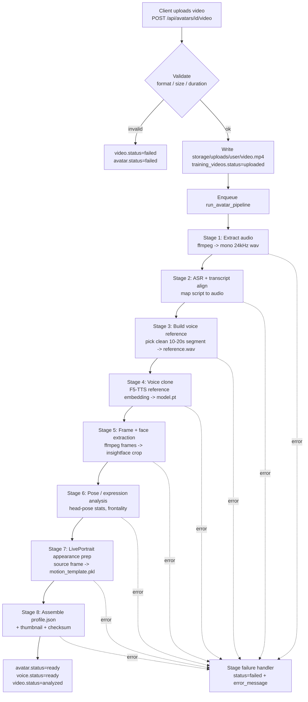
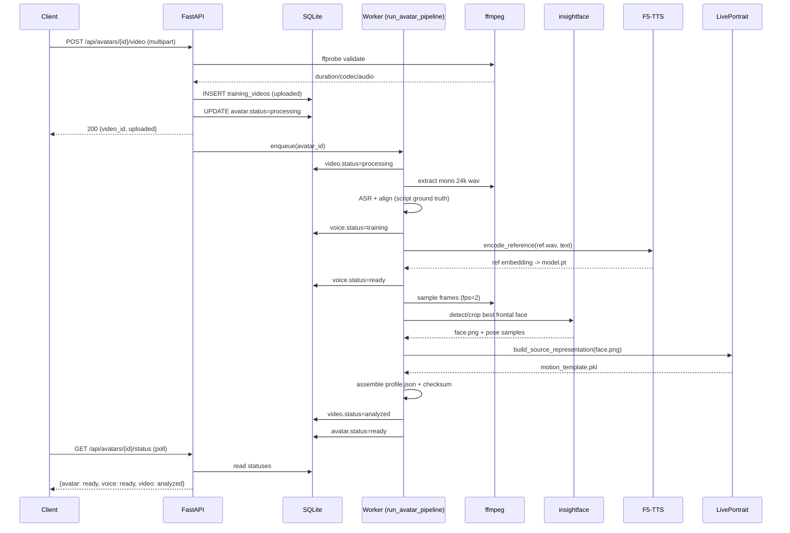
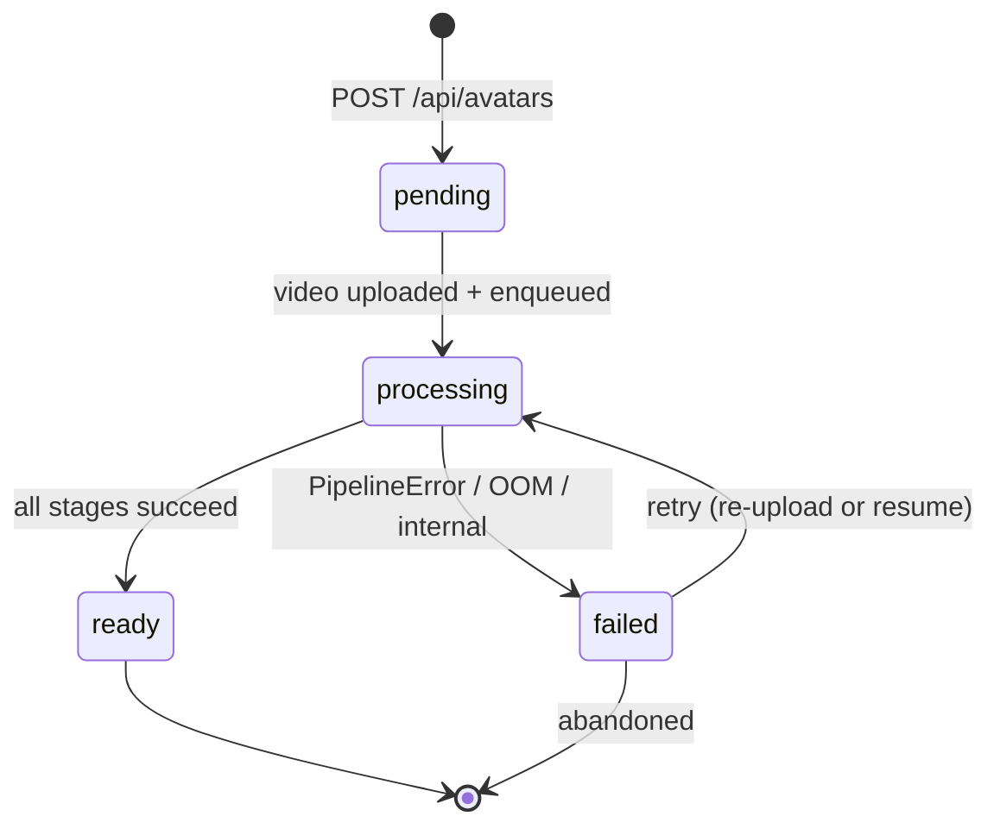

# Avatar Creation Pipeline

> **Scope.** This document covers the **avatar creation (training) side** of the AI Avatar Platform MVP: turning a 2–5 minute user video into a reusable **avatar profile** + **cloned voice**. The reuse path (text → talking-head video via MuseTalk lip-sync) is covered in the separate **Video Generation** document. MuseTalk is referenced here only where it informs what we must persist at creation time.
>
> **Stack.** FastAPI + Python, SQLite + SQLAlchemy, local filesystem storage, single-GPU Kaggle runtime.
> **Models.** F5-TTS (zero-shot voice cloning), LivePortrait (animatable appearance/motion representation), MuseTalk (generation-time lip-sync only). Tooling: ffmpeg, mediapipe/insightface, librosa/torchaudio.

---

## 1. Pipeline Overview

The creation pipeline is a single-GPU, staged worker process. The API accepts uploads and enqueues work; a background worker runs the stages sequentially and writes DB status transitions after each stage. Every stage is **idempotent** and writes its artifacts to the canonical storage layout before marking the stage complete.



**Stage summary**

| # | Stage | Input | Output artifact | DB effect |
|---|-------|-------|-----------------|-----------|
| 0 | Upload + validate | multipart file | `uploads/{user_id}/{video_id}.mp4` | `training_videos.status=uploaded` |
| 1 | Audio extraction | source mp4 | `voices/{avatar_id}/source_audio.wav` (mono 24k) | `video.status=processing` |
| 2 | ASR / transcript align | wav + script | alignment json (in-memory / temp) | — |
| 3 | Reference build | wav + alignment | `voices/{avatar_id}/reference.wav` | `voice.status=training` |
| 4 | Voice clone | reference.wav + transcript | `voices/{avatar_id}/model.pt` | `voice.status=ready` |
| 5 | Frame + face extract | source mp4 | `avatars/{avatar_id}/face.png` | — |
| 6 | Pose / expression | sampled frames | pose stats (into profile) | — |
| 7 | LivePortrait prep | face.png | `avatars/{avatar_id}/motion_template.pkl` | — |
| 8 | Assemble profile | all of the above | `avatars/{avatar_id}/profile.json`, `thumbnail.png` | `avatar.status=ready`, `video.status=analyzed` |

---

## 2. Video Upload Workflow

**Route:** `POST /api/avatars/{id}/video`

Accepts a single multipart file. The avatar row must already exist (`POST /api/avatars`) and be in `pending`. The handler validates the file cheaply (extension, content-type, size) before any disk write, then streams it to the canonical uploads path, probes it with `ffprobe` to confirm real duration/codec, creates the `training_videos` row, and enqueues the worker.

**Limits & accepted inputs**

| Constraint | Value |
|-----------|-------|
| Formats | `.mp4`, `.mov`, `.webm` (content-types `video/mp4`, `video/quicktime`, `video/webm`) |
| Max size | 500 MB |
| Duration | 120–300 s (2–5 min) — enforced via `ffprobe`, not headers |
| Resolution | min 480p short side; warn if < 720p |
| Audio track | required (an audio stream must be present) |

```python
# app/routes/avatars.py
import shutil, uuid, subprocess, json, os
from pathlib import Path
from fastapi import APIRouter, UploadFile, File, HTTPException, BackgroundTasks, Depends
from sqlalchemy.orm import Session

router = APIRouter(prefix="/api/avatars")

ACCEPTED = {"video/mp4": ".mp4", "video/quicktime": ".mov", "video/webm": ".webm"}
MAX_BYTES = 500 * 1024 * 1024
MIN_DUR, MAX_DUR = 120.0, 300.0
UPLOAD_ROOT = Path("storage/uploads")


def ffprobe_meta(path: Path) -> dict:
    out = subprocess.run(
        ["ffprobe", "-v", "error", "-print_format", "json",
         "-show_format", "-show_streams", str(path)],
        capture_output=True, text=True, check=True,
    )
    info = json.loads(out.stdout)
    streams = info["streams"]
    has_audio = any(s["codec_type"] == "audio" for s in streams)
    video = next((s for s in streams if s["codec_type"] == "video"), None)
    if video is None:
        raise ValueError("no video stream")
    duration = float(info["format"]["duration"])
    return {
        "duration": duration,
        "has_audio": has_audio,
        "width": int(video["width"]),
        "height": int(video["height"]),
        "codec": video["codec_name"],
    }


@router.post("/{avatar_id}/video")
async def upload_video(
    avatar_id: str,
    background: BackgroundTasks,
    file: UploadFile = File(...),
    db: Session = Depends(get_db),
):
    avatar = db.get(Avatar, avatar_id)
    if avatar is None:
        raise HTTPException(404, "avatar not found")
    if avatar.status not in ("pending", "failed"):
        raise HTTPException(409, f"avatar not accepting uploads (status={avatar.status})")
    if file.content_type not in ACCEPTED:
        raise HTTPException(415, f"unsupported type {file.content_type}")

    video_id = uuid.uuid4().hex
    user_dir = UPLOAD_ROOT / avatar.user_id
    user_dir.mkdir(parents=True, exist_ok=True)
    dest = user_dir / f"{video_id}{ACCEPTED[file.content_type]}"

    # Stream to disk with a running size guard.
    written = 0
    with dest.open("wb") as out:
        while chunk := await file.read(1 << 20):
            written += len(chunk)
            if written > MAX_BYTES:
                out.close(); dest.unlink(missing_ok=True)
                raise HTTPException(413, "file exceeds 500MB")
            out.write(chunk)

    # Validate the *real* media, not just the declared headers.
    try:
        meta = ffprobe_meta(dest)
    except Exception:
        dest.unlink(missing_ok=True)
        raise HTTPException(422, "unreadable/corrupt media")
    if not meta["has_audio"]:
        dest.unlink(missing_ok=True)
        raise HTTPException(422, "video has no audio track")
    if not (MIN_DUR <= meta["duration"] <= MAX_DUR):
        dest.unlink(missing_ok=True)
        raise HTTPException(422, f"duration {meta['duration']:.1f}s outside 120-300s")

    video = TrainingVideo(
        id=video_id, avatar_id=avatar_id, user_id=avatar.user_id,
        path=str(dest), duration=meta["duration"], width=meta["width"],
        height=meta["height"], codec=meta["codec"], status="uploaded",
    )
    db.add(video); db.commit()

    avatar.status = "processing"; db.commit()
    background.add_task(run_avatar_pipeline, avatar_id)
    return {"video_id": video_id, "status": "uploaded", "duration": meta["duration"]}
```

> **Note on enqueue.** The MVP uses FastAPI `BackgroundTasks` for simplicity on the single-GPU Kaggle box, which serializes naturally to one GPU. A production swap to an RQ/Celery worker keeps the same `run_avatar_pipeline(avatar_id)` entrypoint — see §10.

---

## 3. Training Script Workflow

**Route:** `POST /api/avatars/{id}/script`

Before the user records, we hand them a script to read aloud. A scripted read gives us two things the raw "say whatever" approach cannot:

1. **Better voice clone.** F5-TTS reference quality scales with *phonetic coverage* of the reference clip. A passage engineered to hit every English phoneme class (plosives, fricatives, nasals, diphthongs, voiced/unvoiced pairs) plus prosodic variety yields a reference embedding that generalizes to arbitrary synthesis text.
2. **Neutral pose/expression capture.** Reading at a steady cadence keeps the head roughly frontal and the expression neutral, which is exactly the source frame LivePortrait wants. We get a reliable supply of frontal, eyes-open, mouth-varied frames.

The endpoint generates (or returns a stored) **400–700 word neutral, phonetically rich passage**, persists it to `training_scripts`, and returns it. The transcript is stored so Stage 2 can align it to the recorded audio (we know the ground-truth text, which makes the reference transcript for F5-TTS exact rather than ASR-guessed).

```python
PHONETIC_PANGRAM_SEED = (
    "The quick brown fox jumps over the lazy dog. "
    "Bright vivid jonquils and azure phlox grew by the quay. "
    # ... ~450-650 words assembled from a curated passage bank covering:
    #   plosives  p b t d k g   |  fricatives f v s z sh zh th  |
    #   nasals m n ng | liquids l r | glides w y | diphthongs ai au oi
    #   plus numbers, questions (rising prosody), and an emphatic clause.
)

@router.post("/{avatar_id}/script")
def generate_script(avatar_id: str, db: Session = Depends(get_db)):
    avatar = db.get(Avatar, avatar_id)
    if avatar is None:
        raise HTTPException(404, "avatar not found")
    text = build_training_passage(target_words=(400, 700))  # deterministic per seed
    wc = len(text.split())
    script = TrainingScript(
        id=uuid.uuid4().hex, avatar_id=avatar_id,
        text=text, word_count=wc, language="en", version="v1",
    )
    db.add(script); db.commit()
    return {"script_id": script.id, "word_count": wc, "text": text}
```

**Passage design rules** (enforced by `build_training_passage`):

- 400–700 words, ~3–5 minutes of natural reading.
- Coverage of all English phoneme classes; include at least one of each fricative/plosive pair.
- Mix sentence types: declarative, interrogative (prosody), and one emphatic/exclamatory line.
- No tongue-twisters at sustained density (they distort cadence and head pose).
- Neutral register — nothing emotionally loaded that would skew the neutral-expression frame.

---

## 4. Audio Extraction Workflow

Stage 1 extracts a normalized mono 24 kHz WAV from the source video; Stage 3 then selects a clean reference segment. F5-TTS expects clean 24 kHz mono audio.

**Full-track extraction (mono, 24 kHz, loudness-normalized, silence-trimmed):**

```bash
# 1. Extract + resample to mono 24kHz PCM
ffmpeg -y -i "storage/uploads/${USER_ID}/${VIDEO_ID}.mp4" \
  -vn -ac 1 -ar 24000 -sample_fmt s16 \
  -af "highpass=f=80, lowpass=f=8000, \
       loudnorm=I=-23:LRA=7:TP=-2, \
       silenceremove=start_periods=1:start_threshold=-45dB:start_silence=0.3:\
stop_periods=-1:stop_threshold=-45dB:stop_silence=0.5" \
  "storage/voices/${AVATAR_ID}/source_audio.wav"
```

- `-ac 1 -ar 24000`: mono, 24 kHz (F5-TTS native).
- `highpass=80 / lowpass=8000`: trim subsonic rumble and hiss.
- `loudnorm=I=-23`: EBU R128 loudness normalization to a consistent target.
- `silenceremove`: trims leading/trailing and internal long silences (cadence stays natural).

**Reference segment selection (Stage 3).** We pick a contiguous **10–20 s** window that is clean and continuous. The window is scored with `librosa`/`torchaudio` for SNR, clipping, and speech continuity; we prefer windows that align to a known script span (from Stage 2) so the reference transcript is exact.

```python
import torchaudio, torch, numpy as np

def audio_qc(wav: torch.Tensor, sr: int) -> dict:
    x = wav.squeeze().numpy()
    peak = float(np.max(np.abs(x)))
    clip_ratio = float(np.mean(np.abs(x) > 0.99))
    # crude SNR: speech frames vs noise floor
    frame = 2048
    energy = np.array([np.sqrt(np.mean(x[i:i+frame]**2) + 1e-9)
                       for i in range(0, len(x) - frame, frame)])
    noise = np.percentile(energy, 10)
    speech = np.percentile(energy, 90)
    snr_db = 20 * np.log10((speech + 1e-9) / (noise + 1e-9))
    return {"peak": peak, "clip_ratio": clip_ratio, "snr_db": float(snr_db)}


def select_reference(src_wav_path: str, alignment, out_path: str,
                     min_s=10.0, max_s=20.0) -> dict:
    wav, sr = torchaudio.load(src_wav_path)
    if sr != 24000:
        wav = torchaudio.functional.resample(wav, sr, 24000); sr = 24000
    best, best_score = None, -1e9
    win = int(15 * sr)
    hop = int(2 * sr)
    for start in range(0, max(1, wav.shape[1] - win), hop):
        seg = wav[:, start:start + win]
        qc = audio_qc(seg, sr)
        if qc["clip_ratio"] > 0.01:        # reject clipped windows
            continue
        score = qc["snr_db"] - 50 * qc["clip_ratio"]
        if score > best_score:
            best, best_score = (start, seg, qc), score
    if best is None:
        raise PipelineError("AUDIO_LOW_QUALITY", "no clean 10-20s reference window")
    start, seg, qc = best
    if qc["snr_db"] < 12.0:
        raise PipelineError("AUDIO_LOW_QUALITY", f"SNR {qc['snr_db']:.1f}dB < 12dB")
    torchaudio.save(out_path, seg, sr)
    ref_text = alignment.text_for_span(start / sr, start / sr + 15.0)  # exact transcript
    return {"reference_path": out_path, "qc": qc, "transcript": ref_text,
            "start_s": start / sr, "duration_s": 15.0}
```

**QC reject thresholds:** SNR < 12 dB, clip ratio > 1 %, or peak ≥ 0.99 → raise `AUDIO_LOW_QUALITY` (see §9).

---

## 5. Voice Cloning Workflow

**Important clarification.** F5-TTS is a **zero-shot, reference-based** voice cloner. It does **not** fine-tune weights per user. "Training a voice model" in our DB sense means: *validate + persist the reference clip, compute/cache the reference embedding/conditioning, and store a config artifact that the generation side loads to synthesize in this voice.* This is fast (seconds), GPU-light, and reproducible.

So `model.pt` is **not** a fine-tuned checkpoint — it is a serialized **voice profile artifact**: the reference mel/embedding (as produced by the F5-TTS reference encoder), the exact reference transcript, the sample rate, and the F5-TTS model version used. At generation time we load the shared base F5-TTS weights once and condition on this artifact.

```python
import torch, torchaudio
from f5_tts.api import F5TTS   # zero-shot reference-based API

F5_VERSION = "f5-tts-base-v1"

def build_voice_model(avatar_id: str, reference_path: str, reference_text: str,
                      db) -> str:
    voice = db.query(VoiceModel).filter_by(avatar_id=avatar_id).one()
    voice.status = "training"; db.commit()
    try:
        ref_wav, sr = torchaudio.load(reference_path)
        engine = F5TTS(model=F5_VERSION, device="cuda")
        # Reference embedding / conditioning — NO weight update.
        ref_embedding = engine.encode_reference(ref_wav, sr, reference_text)

        artifact = {
            "kind": "f5tts_voice_profile",
            "model_version": F5_VERSION,
            "sample_rate": sr,
            "reference_path": reference_path,
            "reference_text": reference_text,
            "ref_embedding": ref_embedding.cpu(),   # tensor
            "created_at": utcnow_iso(),
        }
        out = Path("storage/voices") / avatar_id / "model.pt"
        torch.save(artifact, out)

        voice.model_path = str(out)
        voice.model_version = F5_VERSION
        voice.reference_path = reference_path
        voice.status = "ready"; db.commit()
        return str(out)
    except torch.cuda.OutOfMemoryError:
        torch.cuda.empty_cache()
        voice.status = "failed"; voice.error_message = "MODEL_OOM"; db.commit()
        raise PipelineError("MODEL_OOM", "F5-TTS reference encode OOM")
    except Exception as e:
        voice.status = "failed"; voice.error_message = str(e)[:500]; db.commit()
        raise
```

`voice_models` transitions: `pending → training → ready` (or `failed`). The avatar profile later links `voice_model_id`.

---

## 6. Face Extraction Workflow

Stage 5 samples frames, detects faces with **insightface**, and selects the best frontal, neutral, eyes-open frame as the LivePortrait source. That frame is cropped and saved as `face.png`, with a downscaled `thumbnail.png`.

**Frame sampling (ffmpeg, 2 fps over the clip):**

```bash
mkdir -p /tmp/${AVATAR_ID}_frames
ffmpeg -y -i "storage/uploads/${USER_ID}/${VIDEO_ID}.mp4" \
  -vf "fps=2,scale=-1:720" -q:v 2 \
  "/tmp/${AVATAR_ID}_frames/f_%05d.jpg"
```

```python
import cv2, numpy as np
from insightface.app import FaceAnalysis

_app = FaceAnalysis(name="buffalo_l")          # detection + landmarks + pose
_app.prepare(ctx_id=0, det_size=(640, 640))

def sharpness(img):                             # variance of Laplacian
    return cv2.Laplacian(cv2.cvtColor(img, cv2.COLOR_BGR2GRAY), cv2.CV_64F).var()

def eyes_open(face):                            # eye-aspect-ratio from landmarks
    ear = eye_aspect_ratio(face.landmark_2d_106)
    return ear > 0.18

def frontality(face):                           # |yaw|,|pitch| small -> frontal
    yaw, pitch, roll = face.pose
    return float(np.exp(-(abs(yaw) + abs(pitch)) / 20.0))   # 0..1

def select_best_face(frame_dir: str, out_face: str, out_thumb: str) -> dict:
    best, best_score = None, -1.0
    pose_samples = []
    for fp in sorted(Path(frame_dir).glob("*.jpg")):
        img = cv2.imread(str(fp))
        faces = _app.get(img)
        if len(faces) == 0:
            continue
        if len(faces) > 1:
            faces = [max(faces, key=lambda f: (f.bbox[2]-f.bbox[0])*(f.bbox[3]-f.bbox[1]))]
            # multiple faces flagged at pipeline level if it dominates frames
        f = faces[0]
        pose_samples.append(f.pose)
        score = (0.45 * frontality(f)
                 + 0.35 * min(sharpness(img) / 500.0, 1.0)
                 + 0.20 * (1.0 if eyes_open(f) else 0.0))
        if score > best_score:
            best, best_score = (img, f), score

    if best is None:
        raise PipelineError("NO_FACE_DETECTED", "no face found in sampled frames")
    if best_score < 0.45:
        raise PipelineError("LOW_FACE_QUALITY", f"best face score {best_score:.2f} < 0.45")

    img, face = best
    x1, y1, x2, y2 = [int(v) for v in face.bbox]
    pad = int(0.35 * (y2 - y1))                 # headroom for LivePortrait
    crop = img[max(0, y1-pad):y2+pad, max(0, x1-pad):x2+pad]
    crop = cv2.resize(crop, (512, 512))
    cv2.imwrite(out_face, crop)
    cv2.imwrite(out_thumb, cv2.resize(crop, (256, 256)))
    return {"bbox": [x1, y1, x2, y2], "score": best_score,
            "pose_samples": pose_samples}
```

**Quality scoring** combines: **frontality** (small yaw/pitch), **sharpness** (variance of Laplacian), and **eyes-open** (eye-aspect-ratio). A frame must clear `score ≥ 0.45` or we fail with `LOW_FACE_QUALITY`. If most frames contain more than one face, raise `MULTIPLE_FACES`.

---

## 7. Avatar Profile Generation

Stage 7 runs LivePortrait on `face.png` to produce the animatable **motion/appearance template** (`motion_template.pkl`) — the canonical-keypoint + appearance feature representation MuseTalk/LivePortrait consume at generation time. Stage 8 then assembles `profile.json`, computes head-pose statistics from Stage 6 samples, links the `voice_model_id`, writes a checksum, and flips the avatar to `ready`.

```python
from liveportrait.pipeline import LivePortraitPipeline

LP_VERSION = "liveportrait-v1"

def prep_appearance(face_png: str, out_pkl: str) -> dict:
    lp = LivePortraitPipeline(device="cuda")
    rep = lp.build_source_representation(face_png)   # appearance + canonical kp
    rep.save(out_pkl)
    return {"motion_template": out_pkl, "model_version": LP_VERSION}

def head_pose_stats(pose_samples):
    arr = np.array(pose_samples)                     # N x (yaw,pitch,roll)
    return {
        "yaw":   {"mean": float(arr[:,0].mean()), "std": float(arr[:,0].std())},
        "pitch": {"mean": float(arr[:,1].mean()), "std": float(arr[:,1].std())},
        "roll":  {"mean": float(arr[:,2].mean()), "std": float(arr[:,2].std())},
        "n_frames": int(len(arr)),
    }
```

**`profile.json` concrete example:**

```json
{
  "schema_version": "1.0",
  "avatar_id": "a3f9c1e27b4d4f0e9a1b2c3d4e5f6071",
  "user_id": "u_8821",
  "status": "ready",
  "created_at": "2026-06-16T10:42:07Z",
  "face": {
    "reference_frame": "storage/avatars/a3f9.../face.png",
    "thumbnail": "storage/avatars/a3f9.../thumbnail.png",
    "bbox": [412, 188, 902, 760],
    "crop_size": [512, 512],
    "quality_score": 0.81
  },
  "head_pose_stats": {
    "yaw":   {"mean": -1.8, "std": 4.2},
    "pitch": {"mean": 2.1,  "std": 3.0},
    "roll":  {"mean": 0.4,  "std": 2.1},
    "n_frames": 312
  },
  "motion_template": {
    "path": "storage/avatars/a3f9.../motion_template.pkl",
    "model": "liveportrait-v1"
  },
  "voice_model": {
    "voice_model_id": "v_55ab12",
    "path": "storage/voices/a3f9.../model.pt",
    "reference": "storage/voices/a3f9.../reference.wav",
    "model": "f5-tts-base-v1"
  },
  "source_video": {
    "video_id": "9c2d...e1",
    "path": "storage/uploads/u_8821/9c2d...e1.mp4",
    "duration_s": 214.7,
    "resolution": [1280, 720],
    "codec": "h264"
  },
  "model_versions": {
    "f5_tts": "f5-tts-base-v1",
    "liveportrait": "liveportrait-v1",
    "insightface": "buffalo_l",
    "musetalk_target": "musetalk-v1"
  },
  "checksum": "sha256:7d9f...a1b2"
}
```

The `checksum` is a SHA-256 over the concatenated bytes of `face.png`, `motion_template.pkl`, `reference.wav`, and `model.pt` — it lets the generation side detect a stale/corrupt avatar before use.

---

## 8. Storage Format

**Directory contents after a successful run:**

```
storage/
├── uploads/
│   └── u_8821/
│       └── 9c2d...e1.mp4                # original upload (kept)
├── avatars/
│   └── a3f9c1e2.../
│       ├── profile.json                 # canonical avatar profile (§7)
│       ├── face.png                     # 512x512 frontal source frame
│       ├── motion_template.pkl          # LivePortrait appearance/motion rep
│       └── thumbnail.png                # 256x256 UI thumbnail
└── voices/
    └── a3f9c1e2.../
        ├── reference.wav                # clean 10-20s mono 24kHz reference
        ├── source_audio.wav             # full normalized track (Stage 1)
        └── model.pt                     # F5-TTS voice profile artifact
```

**`profile.json` schema spec:**

| Field | Type | Required | Description |
|-------|------|----------|-------------|
| `schema_version` | string | yes | Profile schema version (`"1.0"`) |
| `avatar_id` | string | yes | UUID hex |
| `user_id` | string | yes | Owner |
| `status` | enum | yes | `pending\|processing\|ready\|failed` |
| `created_at` | ISO-8601 | yes | UTC timestamp |
| `face.reference_frame` | path | yes | `face.png` path |
| `face.thumbnail` | path | yes | `thumbnail.png` path |
| `face.bbox` | int[4] | yes | `[x1,y1,x2,y2]` in source pixels |
| `face.crop_size` | int[2] | yes | Stored crop dimensions |
| `face.quality_score` | float | yes | 0..1 best-frame score |
| `head_pose_stats` | object | yes | yaw/pitch/roll mean+std, `n_frames` |
| `motion_template.path` | path | yes | `motion_template.pkl` |
| `motion_template.model` | string | yes | LivePortrait version |
| `voice_model.voice_model_id` | string | yes | FK into `voice_models` |
| `voice_model.path` | path | yes | `model.pt` |
| `voice_model.reference` | path | yes | `reference.wav` |
| `voice_model.model` | string | yes | F5-TTS version |
| `source_video` | object | yes | id, path, duration, resolution, codec |
| `model_versions` | object | yes | All model versions used (reproducibility) |
| `checksum` | string | yes | `sha256:...` over key artifacts |

---

## 9. Error Handling

**Failure taxonomy** (`PipelineError(code, message)` — `code` is persisted as the machine-readable reason, `message` as `error_message`):

| Code | Stage | Cause | User action |
|------|-------|-------|-------------|
| `INVALID_FILE` | Upload | unsupported/corrupt/no-audio | re-upload supported format |
| `DURATION_OUT_OF_RANGE` | Upload | < 120 s or > 300 s | record a 2–5 min clip |
| `AUDIO_LOW_QUALITY` | 3/4 | SNR < 12 dB / clipping | record in a quieter room |
| `NO_FACE_DETECTED` | 5 | no face in any frame | face the camera, good light |
| `MULTIPLE_FACES` | 5 | >1 face dominates frames | record solo |
| `LOW_FACE_QUALITY` | 5 | best frame score < 0.45 | hold still, look at camera |
| `MODEL_OOM` | 4/7 | GPU OOM (F5-TTS/LivePortrait) | retried automatically once |
| `INTERNAL` | any | unexpected exception | retry / contact support |

**Per-stage rollback.** Each stage writes to a temp path then atomically moves into the canonical location only on success. On stage failure we delete that stage's partial artifacts (but keep the original upload), set the relevant row to `failed`, and stamp `error_message`. Earlier-stage artifacts are retained so a retry can resume.

**Setting `failed`:** the orchestrator catches `PipelineError`, sets `avatars.status='failed'` + `error_message=code`, and — depending on the failing stage — `training_videos.status='failed'` and/or `voice_models.status='failed'`.

**Retry & idempotency.** `run_avatar_pipeline(avatar_id)` is **idempotent and resumable**: each stage checks whether its output artifact already exists and is valid (checksum/QC) and skips if so. A retry re-enters from the first incomplete stage. `MODEL_OOM` triggers one automatic retry after `torch.cuda.empty_cache()` and reduced `det_size`/batch; other codes require a user re-upload (which creates a new `training_videos` row, leaving prior failed rows for audit).

```python
class PipelineError(Exception):
    def __init__(self, code, message):
        self.code, self.message = code, message
        super().__init__(f"{code}: {message}")
```

**Python orchestration sketch:**

```python
def run_avatar_pipeline(avatar_id: str):
    db = SessionLocal()
    avatar = db.get(Avatar, avatar_id)
    video = db.query(TrainingVideo).filter_by(avatar_id=avatar_id) \
              .order_by(TrainingVideo.created_at.desc()).first()
    script = db.query(TrainingScript).filter_by(avatar_id=avatar_id).first()

    av_dir = Path("storage/avatars") / avatar_id
    vo_dir = Path("storage/voices") / avatar_id
    av_dir.mkdir(parents=True, exist_ok=True); vo_dir.mkdir(parents=True, exist_ok=True)

    try:
        avatar.status = "processing"
        video.status = "processing"; db.commit()

        # Stage 1: audio  (skip if present)
        src_audio = vo_dir / "source_audio.wav"
        if not src_audio.exists():
            extract_audio(video.path, src_audio)

        # Stage 2: ASR + align (ground-truth text from script)
        alignment = align_transcript(src_audio, script.text if script else None)

        # Stage 3: reference build
        voice = db.query(VoiceModel).filter_by(avatar_id=avatar_id).one()
        ref = vo_dir / "reference.wav"
        ref_meta = select_reference(str(src_audio), alignment, str(ref))

        # Stage 4: voice clone (F5-TTS reference embedding)
        build_voice_model(avatar_id, str(ref), ref_meta["transcript"], db)

        # Stage 5: frames + face
        frame_dir = f"/tmp/{avatar_id}_frames"
        sample_frames(video.path, frame_dir)
        face_meta = select_best_face(frame_dir, str(av_dir / "face.png"),
                                     str(av_dir / "thumbnail.png"))

        # Stage 6: pose stats
        pose_stats = head_pose_stats(face_meta["pose_samples"])

        # Stage 7: LivePortrait appearance prep
        lp_meta = prep_appearance(str(av_dir / "face.png"),
                                  str(av_dir / "motion_template.pkl"))

        # Stage 8: assemble profile + checksum
        profile = assemble_profile(avatar, video, voice, face_meta,
                                   pose_stats, lp_meta, ref_meta)
        write_json(av_dir / "profile.json", profile)

        video.status = "analyzed"
        avatar.status = "ready"
        avatar.error_message = None
        db.commit()

    except PipelineError as e:
        _rollback_stage(av_dir, vo_dir, e.code)
        avatar.status = "failed"; avatar.error_message = e.code
        if e.code in ("INVALID_FILE", "DURATION_OUT_OF_RANGE",
                      "NO_FACE_DETECTED", "MULTIPLE_FACES", "LOW_FACE_QUALITY"):
            video.status = "failed"
        db.commit()
        raise
    except Exception as e:
        avatar.status = "failed"; avatar.error_message = f"INTERNAL: {str(e)[:300]}"
        db.commit(); raise
    finally:
        db.close()
        cleanup_tmp(f"/tmp/{avatar_id}_frames")
```

`GET /api/avatars/{id}/status` simply returns `avatar.status`, `error_message`, and the child `training_videos`/`voice_models` statuses for the client to poll.

---

## 10. Processing Pipeline Diagrams

**Sequence — API + worker + models + DB:**



**State diagram — `avatar.status`:**



**Child status transitions (reference):**

- `training_videos`: `uploaded → processing → analyzed` (or `→ failed`).
- `voice_models`: `pending → training → ready` (or `→ failed`).

> **Worker scaling note.** On Kaggle's single GPU the worker is strictly serial — one `run_avatar_pipeline` at a time — which avoids GPU contention between F5-TTS and LivePortrait. Moving to RQ/Celery later keeps the same entrypoint and idempotent stages; only the enqueue mechanism in §2 changes.
