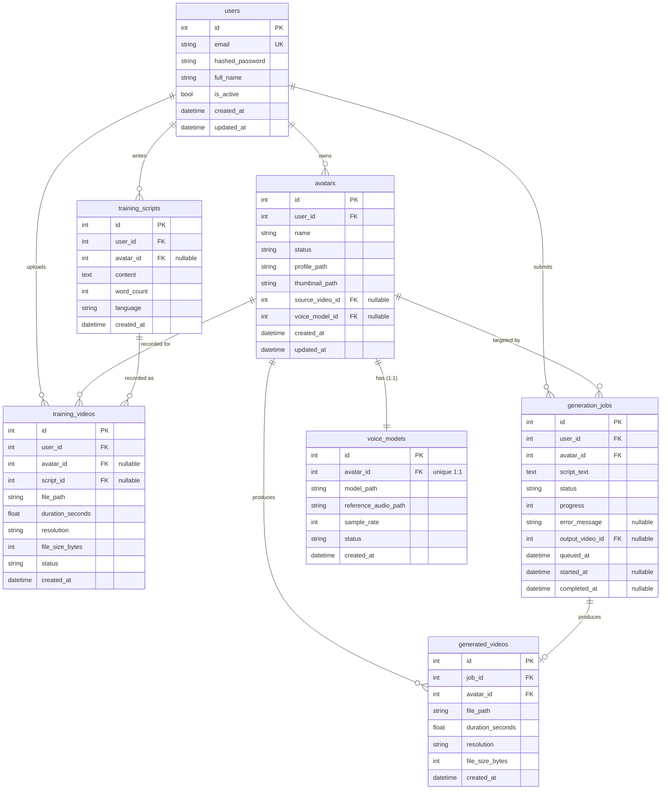

# AI Avatar Platform — Database Schema

> Canonical data model for the AI Avatar Platform MVP (self-hosted).
> Stack: **FastAPI + Python · SQLite · SQLAlchemy 2.0 · Alembic · local filesystem storage**.
> This document is the single source of truth for the 7-table schema. All other design docs depend on it.

---

## 1. Overview & Conventions

The AI Avatar Platform pipeline is: a **user** records a **training video** (optionally reading a **training script**), the platform builds an **avatar** with a 1:1 **voice model**, and the user then submits **generation jobs** that produce **generated videos**. This data model encodes exactly that lifecycle in 7 tables.

### Primary keys — integer autoincrement (recommended)

For this MVP we use **integer autoincrement primary keys** (`INTEGER PRIMARY KEY AUTOINCREMENT` in SQLite), not UUIDs.

| Concern | Integer PK | UUID PK |
|---|---|---|
| SQLite native support | Native `rowid` alias — fastest, smallest index | Stored as 16-byte blob or 36-char text; larger indexes |
| Human/debug friendliness | `avatar 42` is easy to read in logs/URLs | Opaque, hard to eyeball |
| Insert performance | Monotonic, no page splits | Random (v4) causes index fragmentation |
| Distributed/merge needs | Weak (collisions across DBs) | Strong (globally unique) |
| MVP relevance | High — single SQLite file, single node | Low — no sharding, no offline merge |

**Decision:** integer autoincrement. The MVP is single-node with one SQLite file; we do not need global uniqueness, and we benefit from compact indexes and readable IDs. If the platform later shards or exposes IDs publicly and ID-guessing becomes a concern, switch to UUIDv7 (time-ordered) or add a separate opaque `public_id` column — but **not** for the MVP.

### Conventions

- **Timestamps are UTC.** Every timestamp column stores naive UTC datetimes generated by `datetime.now(timezone.utc)`. We never store local time. Application layers convert to the user's locale for display only. Columns use the suffix `_at` (e.g. `created_at`, `queued_at`).
- **Naming.** Tables are `snake_case`, plural (`users`, `generation_jobs`). Columns are `snake_case`, singular. Foreign keys are `<referenced_table_singular>_id` (e.g. `user_id`, `avatar_id`). Booleans are prefixed `is_` (`is_active`). Path columns end in `_path`. Byte counts end in `_bytes`, seconds in `_seconds`.
- **Enums as strings.** All status enums are stored as **lowercase string values** (e.g. `'ready'`), not as integers and not as the Python member name. We use `enum.Enum` in Python and SQLAlchemy's `SAEnum(..., values_callable=...)` so the *value* (not the member name) is persisted. This keeps the SQLite file human-readable and survives reordering of enum members in code. We do **not** rely on SQLite `CHECK` constraints for enums in the MVP (SQLAlchemy emits a `CHECK` for the native enum on SQLite, which is acceptable; new values require a batch migration).
- **Nullability is explicit.** Every column declares nullability. FKs that represent "not yet linked" stages of the pipeline (e.g. `avatar.voice_model_id` before training finishes) are nullable.
- **`created_at` / `updated_at`.** Provided by a shared `TimestampMixin`. `created_at` is set on insert; `updated_at` is set on insert and refreshed on every update via `onupdate`.
- **Foreign keys are enforced.** SQLite does **not** enforce FK constraints by default. We enable `PRAGMA foreign_keys=ON` on every connection (see §7).

---

## 2. Entity Relationship Diagram



> Note on the `avatars ↔ voice_models` and `avatars ↔ training_videos` / `avatars ↔ generation_jobs ↔ generated_videos` cycles: these are intentional. `avatars.source_video_id` and `avatars.voice_model_id` are convenience back-pointers (nullable), while `training_videos.avatar_id` and `voice_models.avatar_id` are the owning FKs. We break the insert-order chicken-and-egg by making the back-pointers nullable and populating them after the child rows exist. See §4.

---

## 3. Complete Schema

### 3.1 `users`

| Column | Type | Constraints | Description |
|---|---|---|---|
| `id` | INTEGER | PK, autoincrement | Surrogate primary key. |
| `email` | VARCHAR(320) | NOT NULL, UNIQUE, indexed | Login identity. 320 = max RFC email length. |
| `hashed_password` | VARCHAR(255) | NOT NULL | bcrypt/argon2 hash. Never store plaintext. |
| `full_name` | VARCHAR(255) | NULL | Display name. |
| `is_active` | BOOLEAN | NOT NULL, default `TRUE` | Soft-disable flag for auth. |
| `created_at` | DATETIME | NOT NULL, default `now()` UTC | Row creation. |
| `updated_at` | DATETIME | NOT NULL, default `now()`, `onupdate now()` | Last modification. |

### 3.2 `training_scripts`

| Column | Type | Constraints | Description |
|---|---|---|---|
| `id` | INTEGER | PK, autoincrement | Surrogate PK. |
| `user_id` | INTEGER | NOT NULL, FK → `users.id` | Author/owner. |
| `avatar_id` | INTEGER | NULL, FK → `avatars.id` | Avatar this script is intended for (may be set after avatar creation). |
| `content` | TEXT | NOT NULL | The script text the user will read aloud. |
| `word_count` | INTEGER | NOT NULL, default `0` | Denormalized count for UX/duration estimation. |
| `language` | VARCHAR(8) | NOT NULL, default `'en'` | ISO 639-1 language code. |
| `created_at` | DATETIME | NOT NULL, default `now()` UTC | Row creation. |

### 3.3 `training_videos`

| Column | Type | Constraints | Description |
|---|---|---|---|
| `id` | INTEGER | PK, autoincrement | Surrogate PK. |
| `user_id` | INTEGER | NOT NULL, FK → `users.id` | Uploader. |
| `avatar_id` | INTEGER | NULL, FK → `avatars.id` | Avatar this footage feeds (set once avatar created). |
| `script_id` | INTEGER | NULL, FK → `training_scripts.id` | Script that was read in this recording. |
| `file_path` | VARCHAR(1024) | NOT NULL | Local filesystem path to the source video. |
| `duration_seconds` | FLOAT | NULL | Clip length in seconds. NULL until analyzed. |
| `resolution` | VARCHAR(16) | NULL | `WxH`, e.g. `'1080x1920'`. NULL until analyzed. |
| `file_size_bytes` | BIGINT | NULL | Size on disk. |
| `status` | ENUM(`video_status`) | NOT NULL, default `'uploaded'` | Processing state. |
| `created_at` | DATETIME | NOT NULL, default `now()` UTC | Upload time. |

### 3.4 `avatars`

| Column | Type | Constraints | Description |
|---|---|---|---|
| `id` | INTEGER | PK, autoincrement | Surrogate PK. |
| `user_id` | INTEGER | NOT NULL, FK → `users.id` | Owner. |
| `name` | VARCHAR(255) | NOT NULL | User-chosen avatar name. |
| `status` | ENUM(`avatar_status`) | NOT NULL, default `'pending'` | Build pipeline state. |
| `profile_path` | VARCHAR(1024) | NULL | Path to processed avatar profile/assets dir. |
| `thumbnail_path` | VARCHAR(1024) | NULL | Path to preview image. |
| `source_video_id` | INTEGER | NULL, FK → `training_videos.id` | The training video used as the source frame/portrait. |
| `voice_model_id` | INTEGER | NULL, FK → `voice_models.id` | The 1:1 voice model (back-pointer). |
| `created_at` | DATETIME | NOT NULL, default `now()` UTC | Creation. |
| `updated_at` | DATETIME | NOT NULL, default `now()`, `onupdate now()` | Last update. |

### 3.5 `voice_models`

| Column | Type | Constraints | Description |
|---|---|---|---|
| `id` | INTEGER | PK, autoincrement | Surrogate PK. |
| `avatar_id` | INTEGER | NOT NULL, **UNIQUE**, FK → `avatars.id` | Owning avatar. UNIQUE enforces the 1:1. |
| `model_path` | VARCHAR(1024) | NULL | Path to the trained F5-TTS voice artifacts. NULL until trained. |
| `reference_audio_path` | VARCHAR(1024) | NULL | Path to the reference audio extracted for cloning. |
| `sample_rate` | INTEGER | NOT NULL, default `24000` | Audio sample rate (Hz). F5-TTS default 24 kHz. |
| `status` | ENUM(`voice_status`) | NOT NULL, default `'pending'` | Training state. |
| `created_at` | DATETIME | NOT NULL, default `now()` UTC | Creation. |

### 3.6 `generation_jobs`

| Column | Type | Constraints | Description |
|---|---|---|---|
| `id` | INTEGER | PK, autoincrement | Surrogate PK. |
| `user_id` | INTEGER | NOT NULL, FK → `users.id` | Submitter. |
| `avatar_id` | INTEGER | NOT NULL, FK → `avatars.id` | Avatar to drive. |
| `script_text` | TEXT | NOT NULL | The text to synthesize/lip-sync for this job. |
| `status` | ENUM(`job_status`) | NOT NULL, default `'queued'` | Queue/worker state. |
| `progress` | INTEGER | NOT NULL, default `0` | 0–100 percent complete. |
| `error_message` | TEXT | NULL | Failure detail when `status='failed'`. |
| `output_video_id` | INTEGER | NULL, FK → `generated_videos.id` | Result video (back-pointer), set on completion. |
| `queued_at` | DATETIME | NOT NULL, default `now()` UTC | Enqueue time. |
| `started_at` | DATETIME | NULL | When a worker picked it up. |
| `completed_at` | DATETIME | NULL | Terminal time (completed/failed/cancelled). |

### 3.7 `generated_videos`

| Column | Type | Constraints | Description |
|---|---|---|---|
| `id` | INTEGER | PK, autoincrement | Surrogate PK. |
| `job_id` | INTEGER | NOT NULL, FK → `generation_jobs.id` | Producing job. |
| `avatar_id` | INTEGER | NOT NULL, FK → `avatars.id` | Avatar shown in the video. |
| `file_path` | VARCHAR(1024) | NOT NULL | Path to the rendered MP4. |
| `duration_seconds` | FLOAT | NULL | Output length. |
| `resolution` | VARCHAR(16) | NULL | `WxH`. |
| `file_size_bytes` | BIGINT | NULL | Size on disk. |
| `created_at` | DATETIME | NOT NULL, default `now()` UTC | Render completion time. |

---

## 4. Relationships & Referential Integrity

All FKs below assume `PRAGMA foreign_keys=ON`. ON DELETE policy is chosen per relationship between **CASCADE** (child is meaningless without parent and should be removed) and **SET NULL** (child can outlive parent or the FK is a soft back-pointer).

| FK | References | ON DELETE | Rationale |
|---|---|---|---|
| `avatars.user_id` | `users.id` | **CASCADE** | An avatar belongs to a user; deleting the user removes their avatars. |
| `avatars.source_video_id` | `training_videos.id` | **SET NULL** | The avatar still exists if its source clip is purged; just drop the pointer. |
| `avatars.voice_model_id` | `voice_models.id` | **SET NULL** | Back-pointer; nulling avoids a delete cycle with `voice_models.avatar_id`. |
| `training_scripts.user_id` | `users.id` | **CASCADE** | Scripts are owned content; remove with the user. |
| `training_scripts.avatar_id` | `avatars.id` | **SET NULL** | A script can predate or outlive an avatar; keep the script. |
| `training_videos.user_id` | `users.id` | **CASCADE** | Owned content. |
| `training_videos.avatar_id` | `avatars.id` | **SET NULL** | Footage may be reused/retained even if the avatar is deleted. |
| `training_videos.script_id` | `training_scripts.id` | **SET NULL** | Recording survives deletion of the script it read. |
| `voice_models.avatar_id` | `avatars.id` | **CASCADE** | A voice model has no meaning without its avatar (1:1). |
| `generation_jobs.user_id` | `users.id` | **CASCADE** | Owned. |
| `generation_jobs.avatar_id` | `avatars.id` | **CASCADE** | A job targets an avatar; if the avatar is gone, the job is moot. |
| `generation_jobs.output_video_id` | `generated_videos.id` | **SET NULL** | Back-pointer; nulling avoids a delete cycle with `generated_videos.job_id`. |
| `generated_videos.job_id` | `generation_jobs.id` | **CASCADE** | A generated video belongs to its job. |
| `generated_videos.avatar_id` | `avatars.id` | **CASCADE** | Rendered output is tied to the avatar identity. |

### Resolving the back-pointer cycles

Two pairs form cycles:

1. `avatars.voice_model_id → voice_models.id` **and** `voice_models.avatar_id → avatars.id`
2. `generation_jobs.output_video_id → generated_videos.id` **and** `generated_videos.job_id → generation_jobs.id`

We break each cycle by:
- making the **back-pointer** (`voice_model_id`, `output_video_id`) **nullable** and **`SET NULL`** on delete, and
- making the **owning FK** (`voice_models.avatar_id`, `generated_videos.job_id`) **NOT NULL** and **`CASCADE`**.

**Insert order:** create the avatar first (voice_model_id NULL) → create the voice_model referencing the avatar → update the avatar's `voice_model_id`. Likewise: insert the job (output_video_id NULL) → render and insert the generated_video referencing the job → update the job's `output_video_id`. Because the owning FK cascades and the back-pointer set-nulls, deleting an avatar deletes its voice_model (cascade) and any avatar reference is consistent; SQLite will not deadlock on the cycle because at most one side is enforced per delete.

> **Note:** SQLAlchemy relationship for `avatars.voice_model_id` ↔ `voice_models.avatar_id` must specify `foreign_keys=` explicitly (two paths exist between the tables). This is handled in §5.

---

## 5. SQLAlchemy 2.0 Models

Copy-paste runnable. SQLAlchemy 2.0 declarative, `Mapped` / `mapped_column`, string-valued enums, shared `TimestampMixin`, and a connection-level `PRAGMA foreign_keys=ON`.

```python
# app/db/models.py
from __future__ import annotations

import enum
from datetime import datetime, timezone

from sqlalchemy import (
    BigInteger,
    Boolean,
    DateTime,
    Enum as SAEnum,
    Float,
    ForeignKey,
    Integer,
    String,
    Text,
    UniqueConstraint,
    Index,
    event,
)
from sqlalchemy.engine import Engine
from sqlalchemy.orm import (
    DeclarativeBase,
    Mapped,
    mapped_column,
    relationship,
)


# --------------------------------------------------------------------------- #
# Base & mixins
# --------------------------------------------------------------------------- #
class Base(DeclarativeBase):
    pass


def utcnow() -> datetime:
    """Naive UTC timestamp (stored as UTC everywhere)."""
    return datetime.now(timezone.utc).replace(tzinfo=None)


class TimestampMixin:
    created_at: Mapped[datetime] = mapped_column(
        DateTime, nullable=False, default=utcnow
    )
    updated_at: Mapped[datetime] = mapped_column(
        DateTime, nullable=False, default=utcnow, onupdate=utcnow
    )


# --------------------------------------------------------------------------- #
# Enforce FK constraints on SQLite (off by default)
# --------------------------------------------------------------------------- #
@event.listens_for(Engine, "connect")
def _set_sqlite_pragma(dbapi_connection, _connection_record):
    cursor = dbapi_connection.cursor()
    cursor.execute("PRAGMA foreign_keys=ON")
    cursor.close()


# --------------------------------------------------------------------------- #
# Enums (string-valued)
# --------------------------------------------------------------------------- #
class AvatarStatus(str, enum.Enum):
    pending = "pending"
    processing = "processing"
    ready = "ready"
    failed = "failed"


class VideoStatus(str, enum.Enum):
    uploaded = "uploaded"
    processing = "processing"
    analyzed = "analyzed"
    failed = "failed"


class VoiceStatus(str, enum.Enum):
    pending = "pending"
    training = "training"
    ready = "ready"
    failed = "failed"


class JobStatus(str, enum.Enum):
    queued = "queued"
    processing = "processing"
    completed = "completed"
    failed = "failed"
    cancelled = "cancelled"


def _enum_col(py_enum, *, name: str):
    """SAEnum that persists the *value* (lowercase string), not the member name."""
    return SAEnum(
        py_enum,
        name=name,
        native_enum=False,                       # store as VARCHAR + CHECK
        values_callable=lambda e: [m.value for m in e],
        validate_strings=True,
    )


# --------------------------------------------------------------------------- #
# users
# --------------------------------------------------------------------------- #
class User(TimestampMixin, Base):
    __tablename__ = "users"

    id: Mapped[int] = mapped_column(Integer, primary_key=True, autoincrement=True)
    email: Mapped[str] = mapped_column(String(320), nullable=False, unique=True, index=True)
    hashed_password: Mapped[str] = mapped_column(String(255), nullable=False)
    full_name: Mapped[str | None] = mapped_column(String(255), nullable=True)
    is_active: Mapped[bool] = mapped_column(Boolean, nullable=False, default=True)

    avatars: Mapped[list["Avatar"]] = relationship(
        back_populates="user", cascade="all, delete-orphan"
    )
    training_scripts: Mapped[list["TrainingScript"]] = relationship(
        back_populates="user", cascade="all, delete-orphan"
    )
    training_videos: Mapped[list["TrainingVideo"]] = relationship(
        back_populates="user", cascade="all, delete-orphan"
    )
    generation_jobs: Mapped[list["GenerationJob"]] = relationship(
        back_populates="user", cascade="all, delete-orphan"
    )


# --------------------------------------------------------------------------- #
# training_scripts
# --------------------------------------------------------------------------- #
class TrainingScript(Base):
    __tablename__ = "training_scripts"

    id: Mapped[int] = mapped_column(Integer, primary_key=True, autoincrement=True)
    user_id: Mapped[int] = mapped_column(
        ForeignKey("users.id", ondelete="CASCADE"), nullable=False, index=True
    )
    avatar_id: Mapped[int | None] = mapped_column(
        ForeignKey("avatars.id", ondelete="SET NULL"), nullable=True, index=True
    )
    content: Mapped[str] = mapped_column(Text, nullable=False)
    word_count: Mapped[int] = mapped_column(Integer, nullable=False, default=0)
    language: Mapped[str] = mapped_column(String(8), nullable=False, default="en")
    created_at: Mapped[datetime] = mapped_column(DateTime, nullable=False, default=utcnow)

    user: Mapped["User"] = relationship(back_populates="training_scripts")
    avatar: Mapped["Avatar | None"] = relationship(
        back_populates="training_scripts", foreign_keys=[avatar_id]
    )
    training_videos: Mapped[list["TrainingVideo"]] = relationship(
        back_populates="script"
    )


# --------------------------------------------------------------------------- #
# training_videos
# --------------------------------------------------------------------------- #
class TrainingVideo(Base):
    __tablename__ = "training_videos"

    id: Mapped[int] = mapped_column(Integer, primary_key=True, autoincrement=True)
    user_id: Mapped[int] = mapped_column(
        ForeignKey("users.id", ondelete="CASCADE"), nullable=False, index=True
    )
    avatar_id: Mapped[int | None] = mapped_column(
        ForeignKey("avatars.id", ondelete="SET NULL"), nullable=True, index=True
    )
    script_id: Mapped[int | None] = mapped_column(
        ForeignKey("training_scripts.id", ondelete="SET NULL"), nullable=True, index=True
    )
    file_path: Mapped[str] = mapped_column(String(1024), nullable=False)
    duration_seconds: Mapped[float | None] = mapped_column(Float, nullable=True)
    resolution: Mapped[str | None] = mapped_column(String(16), nullable=True)
    file_size_bytes: Mapped[int | None] = mapped_column(BigInteger, nullable=True)
    status: Mapped[VideoStatus] = mapped_column(
        _enum_col(VideoStatus, name="video_status"),
        nullable=False,
        default=VideoStatus.uploaded,
    )
    created_at: Mapped[datetime] = mapped_column(DateTime, nullable=False, default=utcnow)

    user: Mapped["User"] = relationship(back_populates="training_videos")
    avatar: Mapped["Avatar | None"] = relationship(
        back_populates="training_videos", foreign_keys=[avatar_id]
    )
    script: Mapped["TrainingScript | None"] = relationship(
        back_populates="training_videos"
    )


# --------------------------------------------------------------------------- #
# avatars
# --------------------------------------------------------------------------- #
class Avatar(TimestampMixin, Base):
    __tablename__ = "avatars"

    id: Mapped[int] = mapped_column(Integer, primary_key=True, autoincrement=True)
    user_id: Mapped[int] = mapped_column(
        ForeignKey("users.id", ondelete="CASCADE"), nullable=False, index=True
    )
    name: Mapped[str] = mapped_column(String(255), nullable=False)
    status: Mapped[AvatarStatus] = mapped_column(
        _enum_col(AvatarStatus, name="avatar_status"),
        nullable=False,
        default=AvatarStatus.pending,
    )
    profile_path: Mapped[str | None] = mapped_column(String(1024), nullable=True)
    thumbnail_path: Mapped[str | None] = mapped_column(String(1024), nullable=True)
    source_video_id: Mapped[int | None] = mapped_column(
        ForeignKey("training_videos.id", ondelete="SET NULL"), nullable=True
    )
    voice_model_id: Mapped[int | None] = mapped_column(
        ForeignKey("voice_models.id", ondelete="SET NULL"), nullable=True
    )

    user: Mapped["User"] = relationship(back_populates="avatars")

    # 1:1 — owning side is voice_models.avatar_id (unique). This is the back-pointer.
    voice_model: Mapped["VoiceModel | None"] = relationship(
        back_populates="avatar_ref",
        foreign_keys=[voice_model_id],
        post_update=True,           # break the insert/update cycle
    )

    # children that reference this avatar via *their* avatar_id
    training_videos: Mapped[list["TrainingVideo"]] = relationship(
        back_populates="avatar", foreign_keys="TrainingVideo.avatar_id"
    )
    training_scripts: Mapped[list["TrainingScript"]] = relationship(
        back_populates="avatar", foreign_keys="TrainingScript.avatar_id"
    )
    generation_jobs: Mapped[list["GenerationJob"]] = relationship(
        back_populates="avatar"
    )
    generated_videos: Mapped[list["GeneratedVideo"]] = relationship(
        back_populates="avatar"
    )

    source_video: Mapped["TrainingVideo | None"] = relationship(
        foreign_keys=[source_video_id]
    )


# --------------------------------------------------------------------------- #
# voice_models  (1:1 with avatars)
# --------------------------------------------------------------------------- #
class VoiceModel(Base):
    __tablename__ = "voice_models"
    __table_args__ = (
        UniqueConstraint("avatar_id", name="uq_voice_models_avatar_id"),
    )

    id: Mapped[int] = mapped_column(Integer, primary_key=True, autoincrement=True)
    avatar_id: Mapped[int] = mapped_column(
        ForeignKey("avatars.id", ondelete="CASCADE"), nullable=False
    )
    model_path: Mapped[str | None] = mapped_column(String(1024), nullable=True)
    reference_audio_path: Mapped[str | None] = mapped_column(String(1024), nullable=True)
    sample_rate: Mapped[int] = mapped_column(Integer, nullable=False, default=24000)
    status: Mapped[VoiceStatus] = mapped_column(
        _enum_col(VoiceStatus, name="voice_status"),
        nullable=False,
        default=VoiceStatus.pending,
    )
    created_at: Mapped[datetime] = mapped_column(DateTime, nullable=False, default=utcnow)

    # owning side of the 1:1 (uses voice_models.avatar_id)
    avatar_ref: Mapped["Avatar"] = relationship(
        back_populates="voice_model", foreign_keys=[avatar_id]
    )


# --------------------------------------------------------------------------- #
# generation_jobs
# --------------------------------------------------------------------------- #
class GenerationJob(Base):
    __tablename__ = "generation_jobs"
    __table_args__ = (
        Index("ix_generation_jobs_status_queued_at", "status", "queued_at"),
    )

    id: Mapped[int] = mapped_column(Integer, primary_key=True, autoincrement=True)
    user_id: Mapped[int] = mapped_column(
        ForeignKey("users.id", ondelete="CASCADE"), nullable=False, index=True
    )
    avatar_id: Mapped[int] = mapped_column(
        ForeignKey("avatars.id", ondelete="CASCADE"), nullable=False, index=True
    )
    script_text: Mapped[str] = mapped_column(Text, nullable=False)
    status: Mapped[JobStatus] = mapped_column(
        _enum_col(JobStatus, name="job_status"),
        nullable=False,
        default=JobStatus.queued,
    )
    progress: Mapped[int] = mapped_column(Integer, nullable=False, default=0)
    error_message: Mapped[str | None] = mapped_column(Text, nullable=True)
    output_video_id: Mapped[int | None] = mapped_column(
        ForeignKey("generated_videos.id", ondelete="SET NULL"), nullable=True
    )
    queued_at: Mapped[datetime] = mapped_column(DateTime, nullable=False, default=utcnow)
    started_at: Mapped[datetime | None] = mapped_column(DateTime, nullable=True)
    completed_at: Mapped[datetime | None] = mapped_column(DateTime, nullable=True)

    user: Mapped["User"] = relationship(back_populates="generation_jobs")
    avatar: Mapped["Avatar"] = relationship(back_populates="generation_jobs")

    # back-pointer to the produced video (cycle-breaking)
    output_video: Mapped["GeneratedVideo | None"] = relationship(
        foreign_keys=[output_video_id],
        post_update=True,
    )
    # owning side: generated_videos.job_id
    generated_video: Mapped["GeneratedVideo | None"] = relationship(
        back_populates="job",
        foreign_keys="GeneratedVideo.job_id",
        uselist=False,
    )


# --------------------------------------------------------------------------- #
# generated_videos
# --------------------------------------------------------------------------- #
class GeneratedVideo(Base):
    __tablename__ = "generated_videos"

    id: Mapped[int] = mapped_column(Integer, primary_key=True, autoincrement=True)
    job_id: Mapped[int] = mapped_column(
        ForeignKey("generation_jobs.id", ondelete="CASCADE"), nullable=False, index=True
    )
    avatar_id: Mapped[int] = mapped_column(
        ForeignKey("avatars.id", ondelete="CASCADE"), nullable=False, index=True
    )
    file_path: Mapped[str] = mapped_column(String(1024), nullable=False)
    duration_seconds: Mapped[float | None] = mapped_column(Float, nullable=True)
    resolution: Mapped[str | None] = mapped_column(String(16), nullable=True)
    file_size_bytes: Mapped[int | None] = mapped_column(BigInteger, nullable=True)
    created_at: Mapped[datetime] = mapped_column(DateTime, nullable=False, default=utcnow)

    job: Mapped["GenerationJob"] = relationship(
        back_populates="generated_video", foreign_keys=[job_id]
    )
    avatar: Mapped["Avatar"] = relationship(back_populates="generated_videos")
```

### Why `post_update=True`

Both `Avatar.voice_model` and `GenerationJob.output_video` reference rows that themselves reference back (cycle). `post_update=True` tells SQLAlchemy to issue a **second UPDATE** after the initial INSERTs to set the back-pointer, which is exactly what we need to populate `avatars.voice_model_id` / `generation_jobs.output_video_id` once the child exists. The owning FKs (`voice_models.avatar_id`, `generated_videos.job_id`) are set on insert normally.

### Minimal engine/session wiring

```python
# app/db/session.py
from sqlalchemy import create_engine
from sqlalchemy.orm import sessionmaker

engine = create_engine("sqlite:///./avatar.db", echo=False, future=True)
SessionLocal = sessionmaker(bind=engine, autoflush=False, expire_on_commit=False)
```

---

## 6. Index Recommendations

| Index | Table(s) / Columns | Type | Why |
|---|---|---|---|
| `ix_users_email` | `users(email)` | UNIQUE | Login lookups by email; uniqueness is a hard business rule. |
| `ix_training_scripts_user_id` | `training_scripts(user_id)` | non-unique | "List my scripts" queries; FK join. |
| `ix_training_scripts_avatar_id` | `training_scripts(avatar_id)` | non-unique | Find scripts for an avatar; FK join. |
| `ix_training_videos_user_id` | `training_videos(user_id)` | non-unique | "List my uploads"; FK join. |
| `ix_training_videos_avatar_id` | `training_videos(avatar_id)` | non-unique | Footage-for-avatar lookups. |
| `ix_training_videos_script_id` | `training_videos(script_id)` | non-unique | Recordings-of-script lookups. |
| `ix_avatars_user_id` | `avatars(user_id)` | non-unique | Dashboard "my avatars" list — the hottest read path. |
| `uq_voice_models_avatar_id` | `voice_models(avatar_id)` | UNIQUE | Enforces the 1:1 avatar↔voice constraint and speeds the join. |
| `ix_generation_jobs_user_id` | `generation_jobs(user_id)` | non-unique | "My jobs" history. |
| `ix_generation_jobs_avatar_id` | `generation_jobs(avatar_id)` | non-unique | Jobs-for-avatar. |
| `ix_generation_jobs_status_queued_at` | `generation_jobs(status, queued_at)` | **composite** | **Queue poller.** The worker runs `SELECT ... WHERE status='queued' ORDER BY queued_at LIMIT 1`. The composite lets SQLite filter by status and return the oldest queued job in index order — no table scan, no sort. Column order matters: equality column (`status`) first, range/sort column (`queued_at`) second. |
| `ix_generated_videos_job_id` | `generated_videos(job_id)` | non-unique | Result lookup from job. |
| `ix_generated_videos_avatar_id` | `generated_videos(avatar_id)` | non-unique | Gallery of an avatar's outputs. |

> Single-column FK indexes are declared via `index=True` on the column; the composite and unique constraint are declared in `__table_args__`. SQLite auto-creates an index for a UNIQUE constraint.

---

## 7. Migration Strategy (Alembic)

### 7.1 Initialize

```bash
pip install alembic
alembic init alembic
```

### 7.2 Point Alembic at our metadata

In `alembic/env.py`:

```python
from app.db.models import Base          # imports all models -> populates Base.metadata
target_metadata = Base.metadata

# Required for SQLite ALTER support:
def run_migrations_online():
    connectable = engine_from_config(...)
    with connectable.connect() as connection:
        context.configure(
            connection=connection,
            target_metadata=target_metadata,
            render_as_batch=True,          # <-- batch mode for SQLite
            compare_type=True,
        )
        with context.begin_transaction():
            context.run_migrations()
```

Set the URL in `alembic.ini`:

```ini
sqlalchemy.url = sqlite:///./avatar.db
```

### 7.3 Autogenerate workflow

```bash
# Create the first migration from the models
alembic revision --autogenerate -m "initial schema: 7 core tables"

# Review the generated script in alembic/versions/*.py BY HAND.
# Autogenerate misses: server defaults, CHECK constraints on string enums,
# ON DELETE clauses on some FKs, and composite index ordering — verify them.

# Apply
alembic upgrade head

# Roll back one step
alembic downgrade -1
```

Migration message naming convention: `verb + subject`, lowercase, e.g. `add error_message to generation_jobs`, `index generation_jobs status queued_at`.

### 7.4 SQLite ALTER limitations & batch mode

SQLite cannot `ALTER COLUMN`, `DROP COLUMN` (pre-3.35), add a constraint, or change FK/CHECK definitions in place. Alembic's **batch mode** (`render_as_batch=True` above, or `with op.batch_alter_table(...) as batch_op:` in the script) emulates these by **copy-and-move**: create a new table, copy rows, drop the old, rename the new. Always use batch operations for column/constraint changes:

```python
def upgrade():
    with op.batch_alter_table("generation_jobs") as batch_op:
        batch_op.add_column(sa.Column("retry_count", sa.Integer(), nullable=False, server_default="0"))
```

### 7.5 Seeding enums

Our enums are **string values inside a column CHECK constraint** (`native_enum=False`), not a separate lookup table, so there is nothing to seed — valid values are enforced by the generated `CHECK (status IN ('queued', ...))`. **Adding a new enum value** therefore requires a batch migration that rebuilds the CHECK:

```python
def upgrade():
    with op.batch_alter_table("generation_jobs") as batch_op:
        batch_op.alter_column(
            "status",
            existing_type=sa.String(),
            type_=sa.Enum("queued","processing","completed","failed","cancelled","paused",
                          name="job_status", native_enum=False),
        )
```

If you instead need **seed reference data** (e.g. a default demo user), put it in a data migration using `op.bulk_insert(...)`, kept separate from schema migrations.

---

## 8. Example Records — Full Lifecycle

A single user goes end-to-end. IDs reflect insertion order; timestamps are UTC.

### users
```json
{
  "id": 1,
  "email": "nauman.pathan@groovyweb.co",
  "hashed_password": "$2b$12$Q9....bcrypt....hash",
  "full_name": "Nauman Pathan",
  "is_active": true,
  "created_at": "2026-06-16T09:00:00",
  "updated_at": "2026-06-16T09:00:00"
}
```

### training_scripts
```json
{
  "id": 10,
  "user_id": 1,
  "avatar_id": null,
  "content": "Hi, I'm building my AI avatar. This recording will be used to clone my voice and capture my expressions for the demo.",
  "word_count": 22,
  "language": "en",
  "created_at": "2026-06-16T09:05:00"
}
```
*(`avatar_id` is NULL here — the avatar doesn't exist yet. It is back-filled to `100` after avatar creation.)*

### training_videos
```json
{
  "id": 50,
  "user_id": 1,
  "avatar_id": null,
  "script_id": 10,
  "file_path": "/data/uploads/u1/raw/nauman_take1.mp4",
  "duration_seconds": 41.8,
  "resolution": "1080x1920",
  "file_size_bytes": 78451200,
  "status": "analyzed",
  "created_at": "2026-06-16T09:10:00"
}
```
*(Lifecycle: inserted as `uploaded` → `processing` → `analyzed`. `avatar_id` back-filled to `100`.)*

### avatars
```json
{
  "id": 100,
  "user_id": 1,
  "name": "Nauman (Demo)",
  "status": "ready",
  "profile_path": "/data/avatars/100/profile/",
  "thumbnail_path": "/data/avatars/100/thumb.png",
  "source_video_id": 50,
  "voice_model_id": 200,
  "created_at": "2026-06-16T09:12:00",
  "updated_at": "2026-06-16T09:20:00"
}
```
*(Created with `status='pending'`, `voice_model_id=null`. After the voice model trains, `voice_model_id` is set to `200` via the `post_update` UPDATE and `status` advances `processing → ready`.)*

### voice_models
```json
{
  "id": 200,
  "avatar_id": 100,
  "model_path": "/data/avatars/100/voice/f5tts_model.safetensors",
  "reference_audio_path": "/data/avatars/100/voice/reference_24k.wav",
  "sample_rate": 24000,
  "status": "ready",
  "created_at": "2026-06-16T09:14:00"
}
```
*(1:1 with avatar 100 — `avatar_id` is UNIQUE. Lifecycle: `pending → training → ready`.)*

### generation_jobs
```json
{
  "id": 300,
  "user_id": 1,
  "avatar_id": 100,
  "script_text": "Welcome to the AI Avatar Platform. This entire clip — my face and my voice — was generated from a single short recording.",
  "status": "completed",
  "progress": 100,
  "error_message": null,
  "output_video_id": 400,
  "queued_at": "2026-06-16T10:00:00",
  "started_at": "2026-06-16T10:00:07",
  "completed_at": "2026-06-16T10:02:35"
}
```
*(Lifecycle: `queued` (progress 0) → poller picks it via `ix_generation_jobs_status_queued_at` → `processing` (progress climbs) → on success the worker inserts generated_video `400`, then sets `output_video_id=400`, `status='completed'`, `progress=100`, `completed_at`.)*

### generated_videos
```json
{
  "id": 400,
  "job_id": 300,
  "avatar_id": 100,
  "file_path": "/data/avatars/100/outputs/job300_final.mp4",
  "duration_seconds": 12.4,
  "resolution": "1080x1920",
  "file_size_bytes": 23658496,
  "created_at": "2026-06-16T10:02:33"
}
```
*(Owning FK `job_id=300` set on insert; the job's `output_video_id` back-pointer is updated to `400` immediately after.)*

---

### Lifecycle summary

```
user(1)
  └─ writes training_script(10)            [avatar_id backfilled -> 100]
  └─ uploads training_video(50, script=10) [uploaded -> analyzed; avatar_id -> 100]
  └─ creates avatar(100, source_video=50)  [pending -> ready]
        └─ trains voice_model(200)         [pending -> ready]  (avatar.voice_model_id -> 200)
        └─ submits generation_job(300)     [queued -> processing -> completed]
              └─ renders generated_video(400)  (job.output_video_id -> 400)
```

This sequence exercises every table, every FK, both cycle-breaking back-pointers, and all four enum types in their terminal `ready`/`completed` states.
