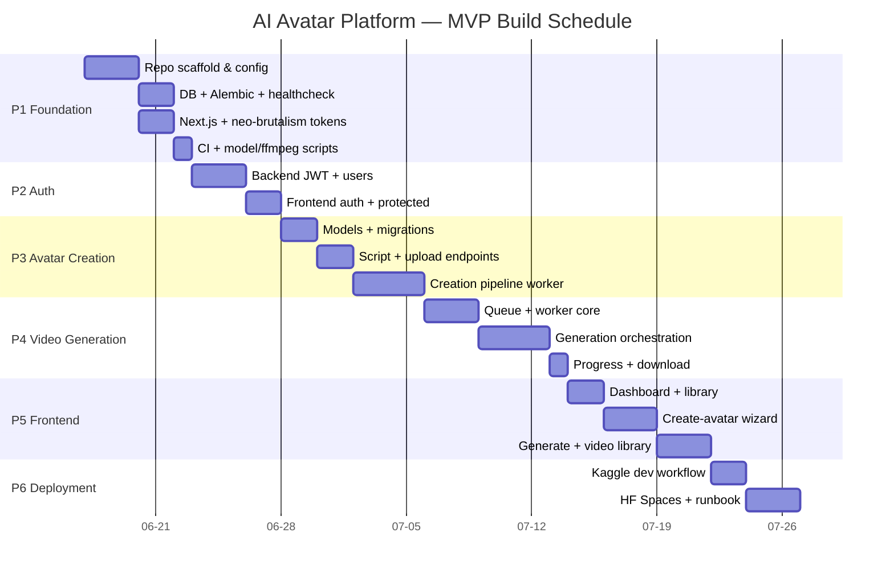
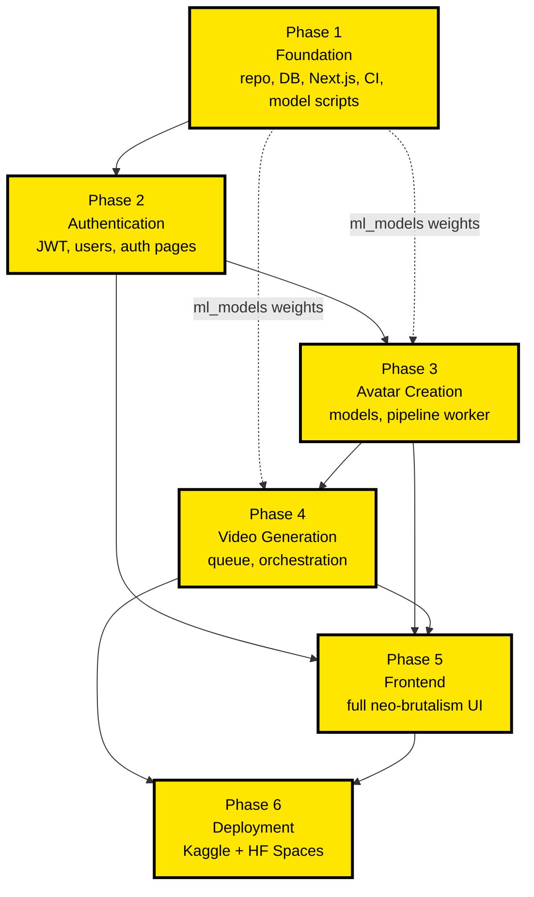

# AI Avatar Platform — Implementation Roadmap

> **Document type:** Delivery / build plan (implementation-ready)
> **Owner:** Technical Product Manager & Delivery Lead
> **Audience:** Engineering / Claude Code build agent
> **Companion docs:** `PRODUCT_REQUIREMENTS.md`, `SYSTEM_ARCHITECTURE.md`, `DATABASE_SCHEMA.md`, `AVATAR_CREATION_PIPELINE.md`, `VIDEO_GENERATION_PIPELINE.md`
> **Last updated:** 2026-06-16

---

## 0. How to Use This Document

This roadmap sequences the build of the **AI Avatar Platform MVP** into **6 phases**. Each phase is a self-contained, mergeable unit of work with a clear **Definition of Done (DoD)**. Build **strictly phase by phase** — later phases assume the artifacts of earlier ones exist and are green.

**Canonical constraints (never contradict — shared across all 6 docs):**

- **No commercial APIs.** All ML is local/open-weight: **F5-TTS** (voice clone), **MuseTalk** (lip sync), **LivePortrait** (animation), **ffmpeg** (muxing/transcode).
- **Frontend:** Next.js 15 + TypeScript + TailwindCSS, **NEO-BRUTALISM** design (thick black borders, hard offset shadows, solid high-contrast color blocks, chunky buttons, monospace accents).
- **Backend:** FastAPI + Python.
- **DB:** SQLite + SQLAlchemy + Alembic.
- **Storage:** local filesystem.
- **Async:** DB-backed job queue + standalone Python worker process.
- **Infra:** Kaggle GPU (dev / model runs) + Hugging Face Spaces (demo hosting).
- **Canonical DB tables:** `users`, `training_scripts`, `training_videos`, `avatars`, `voice_models`, `generation_jobs`, `generated_videos`.
- **Canonical routes:** `/api/auth/{signup,login,refresh,me}`; `/api/avatars` (CRUD); `/api/avatars/{id}/{script,video,status}`; `/api/generate`; `/api/jobs`, `/api/jobs/{id}`; `/api/videos/{id}/download`.
- **Monorepo layout:** `ai-avatar-platform/{frontend,backend,storage,ml_models,docs}`.

---

## 1. Program Timeline (Gantt)

---

## 2. Phase Dependency Flow

**Critical path:** P1 → P2 → P3 → P4 → P5 → P6. The two ML-heavy phases (P3, P4) carry the most schedule risk and both depend on Phase 1's `ml_models` weight-download scripts being functional on Kaggle GPU.

---

## 3. Milestone Table

| # | Milestone | Phase(s) | Gate criteria | Target (rel. day) |
|---|-----------|----------|---------------|--------------------|
| M0 | **Repo bootstrapped** | P1 | Backend `GET /healthcheck` 200; frontend renders themed landing; CI green | Day 6 |
| M1 | **Auth live** | P2 | A user can sign up, log in, hit `/api/auth/me`, refresh token; protected route blocks anon | Day 11 |
| M2 | **Avatar created end-to-end** | P3 | Upload + script → pipeline worker produces a `voice_model` + processed `avatar` asset; status reaches `ready` | Day 19 |
| M3 | **Video generated end-to-end** | P4 | `/api/generate` enqueues; worker runs F5→LivePortrait→MuseTalk→ffmpeg; downloadable MP4 | Day 27 |
| M4 | **Full UI shipped** | P5 | All screens functional against live API; polling, error/loading states, responsive | Day 35 |
| M5 | **Demo deployed** | P6 | HF Spaces demo reachable; Kaggle notebook reproduces a generation; runbook complete | Day 40 |

---

## 4. Definition of Done — Convention

Every phase is "Done" only when **all** of the following hold (phase-specific DoD adds to this baseline):

1. **Code complete:** all files in the phase **Tasks** checklist exist and are wired together.
2. **Deliverables met:** every item in **Deliverables** is demonstrable.
3. **Tests:** unit/integration tests for new modules pass; backend coverage of new logic ≥ 70%.
4. **Lint/format clean:** `ruff` + `black` (backend), `eslint` + `prettier` + `tsc --noEmit` (frontend) all green.
5. **Migrations:** `alembic upgrade head` runs clean from empty DB; downgrade tested.
6. **Reviews run:** `code-review` skill run on the phase diff; for phases touching auth/upload/download (P2, P3, P4) the `security-review` skill is **also** run. Findings resolved or explicitly waived.
7. **Memory updated:** key decisions/architecture written to **claude-mem** so the next session has context.
8. **Demoable:** a 2-minute manual walkthrough proves the phase's headline capability.

---

## 5. Engineering Practices (workflow for whoever builds this)

These are mandatory parts of the build loop, not optional niceties:

- **Cross-session memory — `claude-mem`.** At the start of each phase, load prior context from claude-mem; at the end of each phase, record decisions, file locations, gotchas (e.g., model weight paths, ffmpeg flags, F5-TTS config) so future sessions don't relearn them. Treat it as the project's long-term memory.
- **`security-review` skill — before merge on sensitive code.** Run it on **all** auth, file-upload, and file-download code paths (Phases 2, 3, 4). Specifically scrutinize: JWT signing/verification, password hashing, path traversal on uploads/downloads, file-type/size validation, and SSRF/command-injection in any ffmpeg/model subprocess calls.
- **`code-review` skill — every phase diff before merge.** Run on the full diff of each phase. Resolve correctness, performance, and quality findings before the phase is marked Done.
- **Branch-per-phase.** `phase-1-foundation`, `phase-2-auth`, … merged via PR after the two reviews pass.
- **Conventional commits** and a short `CHANGELOG.md` entry per phase under `docs/`.

---

## 6. Total Effort Rollup

| Phase | Title | Dev-days |
|-------|-------|----------|
| 1 | Foundation | 8 |
| 2 | Authentication | 5 |
| 3 | Avatar Creation | 8 |
| 4 | Video Generation | 8 |
| 5 | Frontend | 8 |
| 6 | Deployment | 5 |
| — | **Subtotal** | **42** |
| — | Contingency (~20%, ML risk) | 8 |
| — | **Total** | **~50 dev-days** |

Single-engineer serial estimate ≈ 8–10 calendar weeks. With one engineer on backend/ML and one on frontend, P5 can partially overlap P3/P4, compressing to ~6–7 weeks.

---

# Phase 1 — Foundation

Establish the monorepo, runnable backend skeleton, database layer, themed frontend shell, CI, and the scripts that pull ffmpeg and all model weights into `ml_models/`. Nothing else can start without this. See `SYSTEM_ARCHITECTURE.md` for the high-level component map.

### Tasks

**Monorepo & tooling**
- [ ] Create `ai-avatar-platform/` with subdirs `frontend/`, `backend/`, `storage/`, `ml_models/`, `docs/`.
- [ ] Move the 5 existing spec docs into `docs/`.
- [ ] Root `README.md` (layout, quickstart), root `.gitignore` (venv, `node_modules`, `storage/*`, `ml_models/weights/*`, `*.db`, `.env`).
- [ ] `.editorconfig`, `LICENSE`, `Makefile` (targets: `setup`, `dev-backend`, `dev-frontend`, `dev-worker`, `lint`, `format`, `migrate`, `download-models`).

**Backend skeleton**
- [ ] `backend/pyproject.toml` (deps: `fastapi`, `uvicorn[standard]`, `sqlalchemy`, `alembic`, `pydantic-settings`, `python-multipart`, `argon2-cffi`/`passlib[bcrypt]`, `python-jose[cryptography]`, `ruff`, `black`, `pytest`, `httpx`).
- [ ] `backend/.python-version`; create venv via `python -m venv .venv`.
- [ ] `backend/app/main.py` — FastAPI app factory, CORS, router registration, `GET /healthcheck` returning `{status, version, db: "ok"}`.
- [ ] `backend/app/core/config.py` — `Settings` (Pydantic): `DATABASE_URL`, `STORAGE_DIR`, `ML_MODELS_DIR`, `JWT_SECRET`, `JWT_ALG`, `ACCESS_TTL`, `REFRESH_TTL`, `CORS_ORIGINS`, `ENV`.
- [ ] `backend/app/core/logging.py` — structured logging config.
- [ ] `backend/app/db/session.py` — engine, `SessionLocal`, `get_db()` dependency.
- [ ] `backend/app/db/base.py` — SQLAlchemy `Base` + model import aggregation point.
- [ ] `backend/app/api/router.py` — top-level `/api` router; mount `health` router.
- [ ] `backend/.env.example`.

**Database (Alembic)**
- [ ] `alembic init backend/alembic`; point `env.py` at `Base.metadata` and `Settings.DATABASE_URL`.
- [ ] Configure SQLite pragmas (WAL mode, `foreign_keys=ON`) via engine event.
- [ ] Empty baseline migration (`alembic revision -m "baseline"`); verify `upgrade head` / `downgrade base`.

**Frontend skeleton + neo-brutalism design tokens**
- [ ] `npx create-next-app@15 frontend` (TypeScript, App Router, Tailwind, ESLint).
- [ ] `frontend/tailwind.config.ts` — neo-brutalism tokens: `colors` (high-contrast palette incl. signal yellow `#FFE600`, black `#000`, white, accent magenta/cyan), `boxShadow.brutal` = `4px 4px 0 0 #000` and `brutal-lg` = `8px 8px 0 0 #000`, `borderWidth.brutal` = `3px`, monospace font family for accents (`fontFamily.mono`).
- [ ] `frontend/app/globals.css` — base layer: thick black borders default, no rounded corners, hard shadows.
- [ ] Primitive components: `components/ui/{Button,Card,Input,Badge,Panel}.tsx` (chunky, bordered, offset-shadow).
- [ ] Themed landing/`app/page.tsx` proving the design system.
- [ ] `frontend/.env.local.example` (`NEXT_PUBLIC_API_BASE_URL`).

**CI / lint / format**
- [ ] `.github/workflows/ci.yml` — jobs: backend (ruff, black --check, pytest), frontend (eslint, prettier --check, tsc, build).
- [ ] `backend/ruff.toml`, shared `black` config in `pyproject.toml`.
- [ ] `frontend/.prettierrc`, `frontend/.eslintrc`.
- [ ] Pre-commit config (optional but recommended).

**ffmpeg + model weight download scripts**
- [ ] `ml_models/README.md` — required models, versions, licenses, expected paths.
- [ ] `ml_models/download_models.py` — fetch F5-TTS, MuseTalk, LivePortrait weights (Hugging Face Hub) into `ml_models/weights/{f5_tts,musetalk,liveportrait}/`; idempotent, checksum-verified, resumable.
- [ ] `ml_models/setup_ffmpeg.sh` — verify/install ffmpeg; print version; fail loudly if missing.
- [ ] `ml_models/verify_env.py` — assert GPU availability (torch CUDA), ffmpeg present, all weight paths resolved.

### Deliverables
- Monorepo with the exact 5-folder layout, committed and CI-green.
- `uvicorn app.main:app` serves `GET /healthcheck` → 200 with DB check.
- `alembic upgrade head` succeeds from an empty SQLite DB.
- `npm run dev` renders a neo-brutalism landing page using shared tokens/components.
- `python ml_models/download_models.py` populates `ml_models/weights/` and `verify_env.py` passes on a Kaggle GPU runtime.

### Dependencies
- None (this is the root). External: Hugging Face Hub access for weights; Kaggle GPU runtime for `verify_env.py`.

### Estimated Effort — 8 dev-days

| Workstream | Days |
|------------|------|
| Monorepo + Makefile + tooling | 1.0 |
| Backend skeleton + config + healthcheck | 1.5 |
| DB + Alembic baseline | 1.0 |
| Next.js + neo-brutalism tokens + primitives | 2.0 |
| CI + lint/format | 1.0 |
| Model/ffmpeg download + verify scripts | 1.5 |

### Risks

| Risk | Likelihood | Impact | Mitigation |
|------|-----------|--------|------------|
| Model weights large / slow / gated on HF | High | Med | Resumable downloads + checksums; cache on Kaggle dataset; document HF token usage |
| CUDA/torch version mismatch on Kaggle | Med | High | Pin torch to Kaggle's CUDA; `verify_env.py` fails fast with guidance |
| ffmpeg missing/old in target runtime | Med | Med | `setup_ffmpeg.sh` checks version; document static-build fallback |
| Tailwind tokens drift from spec aesthetic | Med | Low | Lock tokens in `tailwind.config.ts`; review against PRODUCT_REQUIREMENTS.md |

**Phase DoD:** baseline + M0 gate criteria met.

---

# Phase 2 — Authentication

Implement the `users` table and full JWT auth (signup/login/refresh/me), password hashing, auth dependencies/middleware, and the frontend auth pages with token storage and protected routes. All sensitive code goes through `security-review`.

### Tasks

**Backend**
- [ ] `backend/app/models/user.py` — `User` model (`id`, `email` unique, `hashed_password`, `created_at`, `is_active`) per `DATABASE_SCHEMA.md`.
- [ ] Alembic migration: create `users`.
- [ ] `backend/app/core/security.py` — `hash_password`/`verify_password` (**argon2** preferred, bcrypt fallback); `create_access_token`, `create_refresh_token`, `decode_token` (HS256, `sub`+`exp`+`type` claims).
- [ ] `backend/app/schemas/auth.py` — `SignupRequest`, `LoginRequest`, `TokenPair`, `UserOut` (Pydantic).
- [ ] `backend/app/api/deps.py` — `get_current_user` (Bearer parse → decode → load user), `get_current_active_user`.
- [ ] `backend/app/services/auth_service.py` — signup (dup-email guard), authenticate, refresh-token rotation.
- [ ] `backend/app/api/routes/auth.py` — `POST /api/auth/signup`, `POST /api/auth/login`, `POST /api/auth/refresh`, `GET /api/auth/me`.
- [ ] Wire router into `/api`; add rate-limit hook stub on login/signup.
- [ ] Tests: `tests/test_auth.py` — happy path, dup email, bad password, expired/invalid token, refresh rotation.

**Frontend**
- [ ] `frontend/lib/api.ts` — fetch wrapper (base URL, JSON, error normalization, Authorization header injection).
- [ ] `frontend/lib/auth.ts` — token storage (httpOnly-cookie strategy preferred; if localStorage, document XSS tradeoff), `getToken`, `setTokens`, `clearTokens`, silent refresh.
- [ ] `frontend/app/(auth)/login/page.tsx`, `frontend/app/(auth)/signup/page.tsx` — neo-brutalism forms.
- [ ] `frontend/components/auth/AuthForm.tsx`, `useAuth()` hook / context provider.
- [ ] `frontend/middleware.ts` or layout guard — redirect unauthenticated users away from protected routes.
- [ ] Auth-aware nav (login/logout state).

### Deliverables
- Working signup → login → `/api/auth/me` → refresh cycle (verifiable via `httpx`/curl and UI).
- Passwords stored only as argon2/bcrypt hashes (never plaintext); tokens signed with `JWT_SECRET`.
- Protected route returns 401 without a valid token; UI redirects to login.
- `security-review` skill run on `security.py`, `deps.py`, `auth.py`, token storage — findings resolved.

### Dependencies
- Phase 1 (DB session, config, Alembic, frontend `api.ts` base, primitives).

### Estimated Effort — 5 dev-days

| Workstream | Days |
|------------|------|
| User model + migration + hashing | 1.0 |
| Token issue/verify + deps + service | 1.5 |
| Auth routes + tests | 1.0 |
| Frontend auth pages + storage + guard | 1.5 |

### Risks

| Risk | Likelihood | Impact | Mitigation |
|------|-----------|--------|------------|
| Token stored insecurely (XSS theft) | Med | High | Prefer httpOnly cookies; if localStorage, short access TTL + refresh rotation; `security-review` |
| Weak/leaked JWT secret | Low | High | Secret from env only; never committed; rotate-capable; long random value |
| Refresh-token replay | Med | Med | Token `type` claim, rotation, optional server-side revocation list |
| Password hashing too slow/fast | Low | Med | Tune argon2 params for target hardware; benchmark in tests |

**Phase DoD:** baseline + `security-review` clean + M1 gate met.

---

# Phase 3 — Avatar Creation

Implement the avatar domain (`avatars`, `training_scripts`, `training_videos`, `voice_models`), the script-generation and upload endpoints, and the **avatar creation pipeline worker** that integrates ffmpeg + F5-TTS (voice clone) + LivePortrait prep + face extraction, plus status polling. **Authoritative reference: `AVATAR_CREATION_PIPELINE.md`** — follow its step ordering and intermediate artifact contract exactly.

### Tasks

**Models & migrations**
- [ ] `backend/app/models/avatar.py` — `Avatar` (`id`, `user_id` FK, `name`, `status`, `face_asset_path`, `created_at`).
- [ ] `backend/app/models/training_script.py` — `TrainingScript` (`id`, `avatar_id` FK, `content`, `created_at`).
- [ ] `backend/app/models/training_video.py` — `TrainingVideo` (`id`, `avatar_id` FK, `file_path`, `duration`, `status`).
- [ ] `backend/app/models/voice_model.py` — `VoiceModel` (`id`, `avatar_id` FK, `ref_audio_path`, `embedding_path`, `status`).
- [ ] Alembic migration creating all four with FKs to `avatars`/`users`.

**Endpoints**
- [ ] `backend/app/api/routes/avatars.py` — `/api/avatars` CRUD (owner-scoped); `GET/POST /api/avatars/{id}/script`; `POST /api/avatars/{id}/video`; `GET /api/avatars/{id}/status`.
- [ ] `backend/app/services/script_service.py` — script generation (deterministic local templates / prompt set — **no commercial API**).
- [ ] `backend/app/services/upload_service.py` — multipart video upload; validate mime/size; sanitize filename; store under `storage/users/{user_id}/avatars/{avatar_id}/raw/`; **path-traversal-safe** path builder.
- [ ] `backend/app/schemas/avatar.py` — request/response schemas.

**Creation pipeline worker** (ref `AVATAR_CREATION_PIPELINE.md`)
- [ ] `backend/app/pipelines/avatar_creation/runner.py` — orchestrates the pipeline, updates `avatars.status` / sub-asset statuses through state machine (`pending → processing → ready/failed`).
- [ ] `steps/extract_audio.py` — ffmpeg extract reference audio from training video.
- [ ] `steps/extract_face.py` — detect/crop reference face frame for LivePortrait/MuseTalk.
- [ ] `steps/clone_voice.py` — F5-TTS: build reference embedding / ref-audio config from extracted audio → produce `voice_model`.
- [ ] `steps/liveportrait_prep.py` — prepare LivePortrait driving/source assets from the face crop.
- [ ] `ml/loaders.py` — lazy model loaders reading from `ml_models/weights/` (cache instances, share across jobs).
- [ ] `ml/ffmpeg.py` — safe subprocess wrapper (arg lists, no shell=True), timeouts.
- [ ] Tests: pipeline step unit tests with small fixtures; status transition tests; upload validation tests.

### Deliverables
- A user can create an avatar, receive/store a generated script, upload a training video.
- Pipeline worker processes the upload: extracts audio + face, builds an F5-TTS `voice_model`, prepares LivePortrait assets; `avatars.status` reaches `ready`.
- `GET /api/avatars/{id}/status` reflects live progress for polling.
- All intermediate artifacts land in the documented `storage/` paths.
- `security-review` run on upload endpoint + ffmpeg/subprocess code.

### Dependencies
- Phase 1 (ml_models weights, ffmpeg, DB), Phase 2 (owner scoping via `get_current_user`).

### Estimated Effort — 8 dev-days

| Workstream | Days |
|------------|------|
| 4 models + migration | 1.0 |
| Avatar CRUD + script + upload endpoints | 2.0 |
| Face extraction + audio extraction steps | 1.5 |
| F5-TTS voice clone integration | 2.0 |
| LivePortrait prep + loaders + status machine | 1.0 |
| Tests | 0.5 |

### Risks

| Risk | Likelihood | Impact | Mitigation |
|------|-----------|--------|------------|
| F5-TTS integration harder than expected (config/refs) | High | High | Spike against `AVATAR_CREATION_PIPELINE.md` early; isolate behind `clone_voice.py`; pin model version |
| Face detection fails on poor uploads | Med | Med | Validate video quality on upload; surface clear `failed` status + reason |
| Path traversal / malicious upload | Med | High | Strict filename sanitization, mime/size checks, safe path builder; `security-review` |
| ffmpeg subprocess hangs | Med | Med | Hard timeouts, arg-list calls, status=`failed` on timeout |
| GPU OOM loading multiple models | Med | High | Lazy load, release between steps, document min VRAM |

**Phase DoD:** baseline + `security-review` clean + M2 gate met.

---

# Phase 4 — Video Generation

Implement `generation_jobs` + `generated_videos`, the **DB-backed job queue + standalone Python worker**, and the F5-TTS → LivePortrait → MuseTalk → ffmpeg orchestration with progress reporting and the download endpoint. **Authoritative reference: `VIDEO_GENERATION_PIPELINE.md`** — match its stage ordering, artifact handoffs, and progress percentages.

### Tasks

**Models & queue**
- [ ] `backend/app/models/generation_job.py` — `GenerationJob` (`id`, `user_id`, `avatar_id`, `script_text`, `status`, `progress`, `error`, `created_at`, `started_at`, `finished_at`).
- [ ] `backend/app/models/generated_video.py` — `GeneratedVideo` (`id`, `job_id` FK, `file_path`, `duration`, `thumbnail_path`, `created_at`).
- [ ] Alembic migration for both.
- [ ] `backend/app/queue/db_queue.py` — claim-next-job with `SELECT ... LIMIT 1` + atomic status flip (`pending → running`) using a transaction/row lock pattern safe for SQLite (single-writer); requeue on crash via stale-`running` reaper.

**Worker process**
- [ ] `backend/worker/main.py` — long-running loop: poll queue, claim job, dispatch to orchestrator, heartbeat, update progress, mark `done`/`failed`. Runnable as `python -m worker.main`.
- [ ] `backend/worker/orchestrator.py` — stage pipeline (ref `VIDEO_GENERATION_PIPELINE.md`):
  1. **F5-TTS** synthesize speech audio from `script_text` using the avatar's `voice_model`.
  2. **LivePortrait** animate the source face (idle/expression driving).
  3. **MuseTalk** lip-sync the animated frames to the synthesized audio.
  4. **ffmpeg** mux audio + frames → final MP4; generate thumbnail.
- [ ] `worker/progress.py` — map stage → percentage; persist `generation_jobs.progress`.
- [ ] Reuse `app/pipelines/ml/loaders.py` and `ml/ffmpeg.py` from Phase 3 (shared model cache).

**Endpoints**
- [ ] `backend/app/api/routes/generate.py` — `POST /api/generate` (validate avatar ownership + `ready`; enqueue `generation_job`; return job id).
- [ ] `backend/app/api/routes/jobs.py` — `GET /api/jobs` (user's jobs), `GET /api/jobs/{id}` (status + progress).
- [ ] `backend/app/api/routes/videos.py` — `GET /api/videos/{id}/download` (owner check, `FileResponse`/streaming, **path-safe**, `Content-Disposition`).
- [ ] Tests: enqueue→claim→complete flow with mocked ML stages; download auth/path-traversal tests; reaper test.

### Deliverables
- `POST /api/generate` enqueues a job; the standalone worker picks it up and runs all four stages.
- A downloadable MP4 (with lip-synced audio) is produced and registered as a `generated_video`.
- `GET /api/jobs/{id}` returns increasing `progress` and terminal `done`/`failed`.
- `GET /api/videos/{id}/download` streams the file only to its owner.
- `security-review` run on download endpoint + worker subprocess calls.

### Dependencies
- Phase 3 (avatars `ready`, `voice_model`, LivePortrait prep, loaders, ffmpeg wrapper), Phase 1 weights.

### Estimated Effort — 8 dev-days

| Workstream | Days |
|------------|------|
| Job + video models + migration | 1.0 |
| DB queue + claim/reaper logic | 1.5 |
| Worker loop + heartbeat + progress | 1.5 |
| Orchestration (F5→LivePortrait→MuseTalk→ffmpeg) | 2.5 |
| generate/jobs/download endpoints | 1.0 |
| Tests | 0.5 |

### Risks

| Risk | Likelihood | Impact | Mitigation |
|------|-----------|--------|------------|
| MuseTalk ↔ LivePortrait artifact handoff mismatch | High | High | Follow `VIDEO_GENERATION_PIPELINE.md` contract; integration test per stage boundary |
| SQLite write contention under concurrent jobs | Med | Med | Single worker (MVP) + WAL; document scale-out path |
| Long generation times / perceived hang | High | Med | Granular progress %, heartbeat, frontend ETA; cap script length |
| Crashed worker leaves jobs stuck `running` | Med | Med | Stale-job reaper requeues after timeout |
| Download path traversal / IDOR | Med | High | Owner check + safe path resolution; `security-review` |

**Phase DoD:** baseline + `security-review` clean + M3 gate met.

---

# Phase 5 — Frontend

Build the full **neo-brutalism** UI against the live API: dashboard, create-avatar wizard (script display + webcam/upload recorder), avatar library, generate-video page (script box + job progress), and video library with download. Includes API client, polling hooks, and loading/error/empty states across all screens. Run the design polish via the design skills where useful.

### Tasks

**App shell & client**
- [ ] `frontend/app/(app)/layout.tsx` — authed shell: chunky bordered sidebar/nav, monospace section labels, hard-shadow panels.
- [ ] `frontend/lib/apiClient.ts` — typed endpoints for avatars/generate/jobs/videos (built on Phase 2 `api.ts`).
- [ ] `frontend/lib/types.ts` — TS types mirroring backend schemas.
- [ ] `frontend/hooks/usePolling.ts` — generic interval poller (start/stop, backoff, cleanup).
- [ ] `frontend/hooks/useJobStatus.ts`, `useAvatarStatus.ts` — poll until terminal state.

**Dashboard**
- [ ] `frontend/app/(app)/dashboard/page.tsx` — counts (avatars, jobs, videos), recent activity, primary CTAs as chunky buttons.

**Create-avatar wizard**
- [ ] `frontend/app/(app)/avatars/new/page.tsx` — multi-step wizard.
- [ ] `components/avatar/ScriptDisplay.tsx` — show generated training script (monospace block, bordered).
- [ ] `components/avatar/Recorder.tsx` — webcam capture (`getUserMedia` + `MediaRecorder`) **and** file upload fallback; preview; constraints (duration/size).
- [ ] Upload progress + `useAvatarStatus` polling until `ready`; surface `failed` reasons.

**Avatar library**
- [ ] `frontend/app/(app)/avatars/page.tsx` — grid of avatar cards (status badge, thumbnail, actions).
- [ ] `components/avatar/AvatarCard.tsx`.

**Generate-video page**
- [ ] `frontend/app/(app)/generate/page.tsx` — pick avatar, script textarea (bordered, monospace), submit to `/api/generate`.
- [ ] `components/generate/JobProgress.tsx` — `useJobStatus` polling; stage labels + chunky progress bar; result link on completion.

**Video library + download**
- [ ] `frontend/app/(app)/videos/page.tsx` — grid of `generated_videos`; inline `<video>` preview; download button → `/api/videos/{id}/download`.
- [ ] `components/video/VideoCard.tsx`.

**Cross-cutting**
- [ ] Loading skeletons (bordered placeholder blocks), error banners (hard-shadow alert), empty states (illustrative neo-brutalist panels) for every screen.
- [ ] Responsive layouts (mobile → desktop) preserving thick borders/offset shadows.
- [ ] Toasts/inline validation; disable buttons while pending.

### Deliverables
- Every screen functional end-to-end against the live backend.
- Webcam recording **and** file upload both work in the wizard.
- Job/avatar status polling drives live progress without manual refresh.
- Consistent loading/error/empty states; responsive at mobile + desktop breakpoints.
- Cohesive neo-brutalism look (thick black borders, hard offset shadows, solid blocks, chunky buttons, monospace accents) matching `PRODUCT_REQUIREMENTS.md`.

### Dependencies
- Phase 2 (auth/guard), Phase 3 (avatar/script/upload/status APIs), Phase 4 (generate/jobs/download APIs), Phase 1 design tokens.

### Estimated Effort — 8 dev-days

| Workstream | Days |
|------------|------|
| App shell + API client + polling hooks | 1.5 |
| Dashboard + avatar library | 1.5 |
| Create-avatar wizard + recorder | 2.5 |
| Generate page + job progress | 1.5 |
| Video library + download | 0.5 |
| States + responsive polish | 0.5 |

### Risks

| Risk | Likelihood | Impact | Mitigation |
|------|-----------|--------|------------|
| Webcam/MediaRecorder browser inconsistencies | Med | Med | Feature-detect; always offer file-upload fallback; test Chromium/Firefox |
| Polling overload / leaks | Med | Med | Centralized `usePolling` with cleanup + backoff; stop on terminal state |
| Long jobs hurt UX | High | Med | Clear staged progress + ETA + non-blocking navigation |
| Neo-brutalism inconsistency across screens | Med | Low | Shared primitives + tokens; run `design`/`impeccable` skill audit |

**Phase DoD:** baseline + M4 gate met.

---

# Phase 6 — Deployment

Stand up the **Kaggle GPU dev workflow** (notebook runner for model-heavy runs) and the **Hugging Face Spaces demo hosting** strategy, documenting Spaces' real limitations (ephemeral storage, runtime caps, secrets), env/secret handling, model weight caching, smoke tests, and a runbook. See `SYSTEM_ARCHITECTURE.md` for the infra topology.

### Tasks

**Kaggle GPU dev workflow**
- [ ] `docs/deployment/kaggle.md` — how to run model/pipeline jobs on Kaggle GPU.
- [ ] `ml_models/kaggle_runner.ipynb` — clone repo, `download_models.py`, `verify_env.py`, run a sample avatar-create + video-generate end-to-end on GPU; persist weights to a **Kaggle Dataset** for reuse.
- [ ] Document Kaggle session limits (GPU quota/hours, 9h max, no persistent server) and how dev uses it for batch/model runs only.

**Hugging Face Spaces demo**
- [ ] `docs/deployment/hf_spaces.md` — hosting strategy + explicit limitations.
- [ ] Decide Space SKU: **CPU demo** (mocked/precomputed ML, fast UI demo) vs **GPU Space** (paid; real generation). Recommend a constrained demo profile for MVP.
- [ ] `Dockerfile`(s) for the Space (FastAPI + built Next.js static export OR combined container).
- [ ] `huggingface.yml` / Space metadata; expose only the demo subset of routes.
- [ ] **Persistence caveat:** Spaces filesystem is **ephemeral** — document that `storage/` resets on rebuild/sleep; for demo, use a temp dir + auto-cleanup and/or read-only sample assets; note optional persistent-storage add-on.
- [ ] **Model weight caching:** cache weights to the HF cache dir / Space persistent volume; lazy-download on cold start with clear timeout messaging.

**Secrets & config**
- [ ] `docs/deployment/secrets.md` — `JWT_SECRET`, `HF_TOKEN`, `DATABASE_URL` via Space Secrets / Kaggle Secrets (never committed); `.env.example` parity check.

**Smoke tests & runbook**
- [ ] `scripts/smoke_test.py` — hit `/healthcheck`, signup/login, create avatar (sample), generate, download; assert 2xx + artifact exists.
- [ ] `docs/deployment/runbook.md` — start/stop, cold-start expectations, common failures (OOM, weight download timeout, ephemeral-storage data loss), rollback, and "is it healthy?" checklist.
- [ ] CI hook (optional): run smoke test against a deployed preview.

### Deliverables
- Reproducible Kaggle notebook that runs the full pipeline on GPU and caches weights to a Kaggle Dataset.
- A live Hugging Face Space serving the demo, with documented (and handled) ephemeral-storage and runtime limitations.
- Secrets sourced from platform secret stores; nothing sensitive in git.
- Passing `smoke_test.py` against the deployed demo.
- Complete `runbook.md`.

### Dependencies
- Phase 4 (working generation pipeline) and Phase 5 (UI) — the demo hosts both. Phase 1 model scripts.

### Estimated Effort — 5 dev-days

| Workstream | Days |
|------------|------|
| Kaggle notebook runner + dataset caching | 1.5 |
| HF Spaces Dockerfile + metadata + deploy | 1.5 |
| Secrets + env wiring | 0.5 |
| Smoke tests | 0.5 |
| Runbook + limitations docs | 1.0 |

### Risks

| Risk | Likelihood | Impact | Mitigation |
|------|-----------|--------|------------|
| HF Spaces ephemeral storage loses user data | High | Med | Document clearly; demo treats storage as disposable; optional persistent-storage add-on noted |
| Free CPU Space can't run real ML in time | High | High | Offer mocked/precomputed demo path on CPU; reserve real generation for GPU Space/Kaggle |
| Cold-start weight download exceeds Space timeout | Med | High | Bake/cache weights into image or persistent volume; show loading state |
| Secret leakage in notebook/repo | Med | High | Platform secret stores only; scan diffs; `security-review` on any auth-touching deploy config |
| Kaggle GPU quota exhaustion mid-run | Med | Med | Checkpoint weights to Dataset; keep runs short; document quota |

**Phase DoD:** baseline + M5 gate met + runbook published.

---

## 7. Appendix — Build Sequencing Checklist (TL;DR)

1. **P1 Foundation** → repo, healthcheck, DB, themed shell, CI, model/ffmpeg scripts. *(M0)*
2. **P2 Auth** → JWT, users, auth pages, protected routes. Run `security-review`. *(M1)*
3. **P3 Avatar Creation** → 4 models, script/upload, creation pipeline (ffmpeg + F5-TTS + LivePortrait prep + face extraction). Run `security-review`. *(M2)*
4. **P4 Video Generation** → jobs/videos, DB queue + worker, F5→LivePortrait→MuseTalk→ffmpeg, download. Run `security-review`. *(M3)*
5. **P5 Frontend** → full neo-brutalism UI, polling, states, responsive. *(M4)*
6. **P6 Deployment** → Kaggle runner + HF Spaces demo + secrets + smoke tests + runbook. *(M5)*

> Per phase, in order: load **claude-mem** context → build → tests/lint/migrations green → run **code-review** (and **security-review** on P2/P3/P4) → resolve findings → record decisions to **claude-mem** → merge phase branch.
