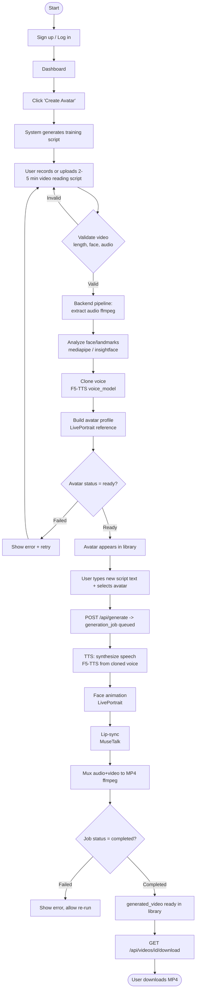
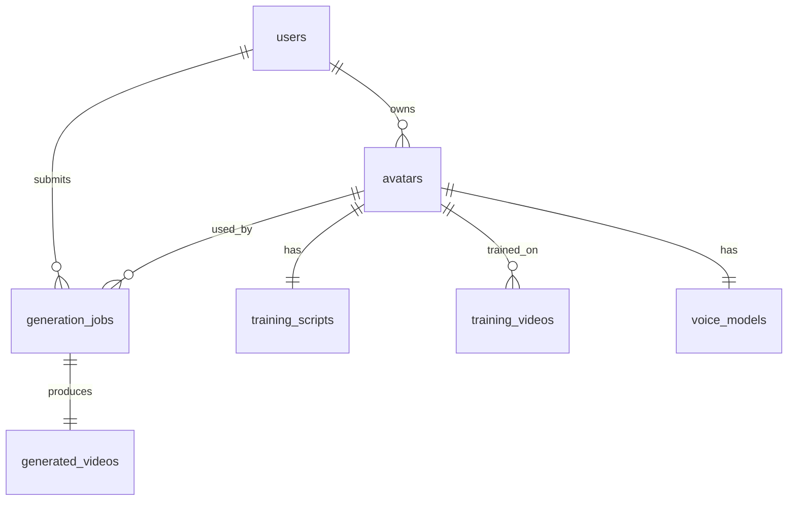

# AI Avatar Platform — Product Requirements Document (PRD)

| Field | Value |
|---|---|
| Document | Product Requirements Document (PRD) |
| Product | AI Avatar Platform (self-hosted MVP) |
| Version | 1.0 |
| Status | Approved for implementation |
| Date | 2026-06-16 |
| Owner | AI Solutions Architect / Technical PM |
| Audience | Engineering (Claude Code build agent), Design, QA |

---

## 1. Vision

The **AI Avatar Platform** lets a single user turn a short (2–5 minute) self-recorded video into a **reusable talking-head avatar**, then generate unlimited new talking videos from plain text — entirely on **open-source models** and **self-hosted infrastructure**. No commercial avatar APIs (HeyGen, Synthesia, D-ID) are used at any point.

The product collapses what is normally a multi-vendor, recurring-cost workflow into one private pipeline:

1. The user signs up and clicks **Create Avatar**.
2. The system generates a phonetically-balanced **training script** for them to read.
3. The user records or uploads a 2–5 minute video reading that script.
4. The system **analyzes face, voice, expressions, and head movement** and builds a **reusable avatar profile** (a cloned voice + a reference face/animation profile).
5. Later, the user types **any script**, and the system renders a new **MP4** using the cloned voice + avatar profile + lip-sync.
6. The user **downloads the MP4**.

The MVP optimizes for **ownership, privacy, and zero per-render licensing cost**, accepting that generation runs in **minutes, not seconds**, on a single GPU. The design language is **neo-brutalism**: thick black borders, hard offset drop-shadows, high-contrast solid color blocks, chunky buttons, and monospace accents — a deliberately bold, "tool-not-toy" aesthetic.

The North Star: **a user can go from signup to a downloaded, lip-synced, self-voiced MP4 in a single session, using only open-source models.**

---

## 2. Goals

### 2.1 Measurable Success Metrics

| ID | Goal | Target (MVP) |
|---|---|---|
| G-1 | End-to-end first-avatar success | A new user can create an avatar and download a generated video in ≤ 1 session, ≥ 80% success rate across valid inputs |
| G-2 | Avatar build time | Voice clone + avatar profile build completes in ≤ 15 min wall-clock per avatar on one Kaggle T4/P100-class GPU |
| G-3 | Generation latency | ≤ 8 minutes of render time per 1 minute of output video (8:1 ratio) on one GPU; tracked as `minutes_per_render_minute` |
| G-4 | Output quality (lip-sync) | ≥ 4 of 5 internal reviewers rate lip-sync "acceptable or better" on a 5-point scale for a 30s sample |
| G-5 | Voice similarity | Cloned voice judged "recognizably the same speaker" by ≥ 4 of 5 internal reviewers |
| G-6 | Job reliability | ≥ 95% of generation jobs that reach `processing` finish `completed` (not `failed`) for valid inputs |
| G-7 | API correctness | 100% of canonical API routes implemented and passing contract tests |
| G-8 | Cost | $0 recurring third-party inference cost; runs on free/low-cost Kaggle GPU + Hugging Face Spaces |

### 2.2 Non-Goals (explicitly NOT goals for this product)

- Real-time / sub-second avatar generation.
- Multi-tenant SaaS scale, billing, or team workspaces.
- Photorealistic full-body avatars, gestures beyond head/face, or background replacement.
- Multi-language voice cloning beyond the input language (single-language MVP).
- Mobile native apps (responsive web only).
- Live streaming / interactive conversational avatars.

---

## 3. User Personas

### 3.1 Solo Content Creator — "Maya"

| Attribute | Detail |
|---|---|
| Role | YouTuber / TikTok creator, non-technical |
| Goal | Produce talking-head clips from scripts without re-recording each time |
| Pain | Filming setup, retakes, time cost per video |
| Tech comfort | Low–medium; expects a guided UI |
| Success looks like | Records once, then types scripts and downloads MP4s on demand |
| Key features | Guided avatar creation, simple generation form, library/downloads |

### 3.2 Educator — "Dr. Okafor"

| Attribute | Detail |
|---|---|
| Role | University lecturer / online course author |
| Goal | Convert lecture notes into consistent narrated video lessons |
| Pain | Time to film many short lessons; wants visual consistency across modules |
| Tech comfort | Medium |
| Success looks like | One avatar reused across an entire course; batch of short videos |
| Key features | Reusable avatar profile, consistent voice, downloadable MP4 per lesson |

### 3.3 Small-Business Marketer — "Liam"

| Attribute | Detail |
|---|---|
| Role | Marketer at a small company |
| Goal | Spokesperson videos for ads, product updates, onboarding |
| Pain | Agency/tool costs and turnaround time |
| Tech comfort | Medium |
| Success looks like | Self-hosted, no per-video license fees, fast iteration on copy |
| Key features | Text-to-video generation, library management, cost-free renders |

### 3.4 Developer / Tinkerer — "Priya"

| Attribute | Detail |
|---|---|
| Role | ML/engineer evaluating open-source avatar pipelines |
| Goal | Understand and extend the F5-TTS + MuseTalk + LivePortrait stack |
| Pain | Glue code, environment setup, GPU orchestration |
| Tech comfort | High |
| Success looks like | Clean API, inspectable jobs, swappable models |
| Key features | Documented REST API, job status endpoints, local storage layout |

---

## 4. User Flow

End-to-end journey from signup to download.



### 4.1 Flow Notes & Acceptance Criteria

- **Script generation** returns a phonetically-balanced passage (~350–600 words, ≈2–5 min read) so the clone captures diverse phonemes.
- **Video validation** is synchronous and fast (length 2–5 min, exactly one clearly-visible face, audible speech track present). Failures return a specific reason.
- **Avatar build** and **generation** are **asynchronous jobs**; the UI polls `GET /api/avatars/{id}/status` and `GET /api/jobs/{id}`.
- The user must pass the **consent gate** (Section 6, NFR-PRIV) before any face/voice processing begins.

---

## 5. Functional Requirements

Priority uses **MoSCoW**: **M**ust, **S**hould, **C**ould, **W**on't (this release).

### 5.1 Auth

| ID | Requirement | Priority | API |
|---|---|---|---|
| FR-AUTH-1 | User can sign up with email + password; password stored hashed (bcrypt/argon2) | M | `POST /api/auth/signup` |
| FR-AUTH-2 | User can log in and receive a JWT access token + refresh token | M | `POST /api/auth/login` |
| FR-AUTH-3 | User can refresh an expired access token using a valid refresh token | M | `POST /api/auth/refresh` |
| FR-AUTH-4 | User can fetch their own profile | M | `GET /api/auth/me` |
| FR-AUTH-5 | All avatar/generation/library routes require a valid access token | M | (all protected) |
| FR-AUTH-6 | Reject duplicate emails and weak passwords (min length policy) | S | `POST /api/auth/signup` |

**Acceptance criteria (FR-AUTH-1/2):**
- Signup with a new email returns 201 and a user record in `users`.
- Login with correct credentials returns 200 + tokens; wrong credentials return 401.
- Passwords are never stored or logged in plaintext.

### 5.2 Avatar Creation

| ID | Requirement | Priority | API |
|---|---|---|---|
| FR-AV-1 | User can create an avatar shell (name + consent) | M | `POST /api/avatars` |
| FR-AV-2 | User can list their avatars with status | M | `GET /api/avatars` |
| FR-AV-3 | User can view a single avatar's detail/status | M | `GET /api/avatars/{id}` |
| FR-AV-4 | User can delete an avatar (and its derived files) | M | `DELETE /api/avatars/{id}` |
| FR-AV-5 | System generates a phonetically-balanced training script for the avatar | M | `POST /api/avatars/{id}/script` |
| FR-AV-6 | User can upload a 2–5 min training video reading the script | M | `POST /api/avatars/{id}/video` |
| FR-AV-7 | System extracts audio (ffmpeg) and validates one clear face + audible speech | M | (pipeline) |
| FR-AV-8 | System clones the voice (F5-TTS) into a reusable `voice_model` | M | (pipeline) |
| FR-AV-9 | System builds a reusable avatar profile (face reference + LivePortrait params) | M | (pipeline) |
| FR-AV-10 | User can poll avatar build status (`pending`→`processing`→`ready`/`failed`) | M | `GET /api/avatars/{id}/status` |
| FR-AV-11 | Avatar build runs asynchronously; UI is not blocked | M | (pipeline) |
| FR-AV-12 | Failed builds expose a human-readable failure reason and allow re-upload | S | `GET /api/avatars/{id}/status` |

**Acceptance criteria (FR-AV-5 to FR-AV-10):**
- `POST /api/avatars/{id}/script` returns text in `training_scripts` linked to the avatar.
- Uploading a 90s video is rejected (too short); a 6-min video is rejected (too long); a 3-min valid video is accepted.
- After a successful build, the avatar status is `ready`, a `voice_models` row exists, and the avatar is selectable for generation.
- A video with no detectable face fails with reason `no_face_detected`.

### 5.3 Video Generation

| ID | Requirement | Priority | API |
|---|---|---|---|
| FR-GEN-1 | User submits `script_text` + `avatar_id` to create a generation job | M | `POST /api/generate` |
| FR-GEN-2 | System synthesizes speech from the cloned voice (F5-TTS) | M | (pipeline) |
| FR-GEN-3 | System animates the face (LivePortrait) and applies lip-sync (MuseTalk) | M | (pipeline) |
| FR-GEN-4 | System muxes audio+video into a downloadable MP4 (ffmpeg) | M | (pipeline) |
| FR-GEN-5 | User can list their generation jobs | M | `GET /api/jobs` |
| FR-GEN-6 | User can poll a single job's status + progress | M | `GET /api/jobs/{id}` |
| FR-GEN-7 | Enforce script length limits (≈ output ≤ a few minutes) | M | `POST /api/generate` |
| FR-GEN-8 | Jobs run on a single-worker GPU queue (serialized) | M | (pipeline) |
| FR-GEN-9 | Failed jobs expose a failure reason and can be retried | S | `GET /api/jobs/{id}` |
| FR-GEN-10 | Generation rejects avatars not in `ready` state | M | `POST /api/generate` |

**Acceptance criteria (FR-GEN-1 to FR-GEN-6):**
- Submitting valid `script_text` + a `ready` avatar returns a job id with status `queued`.
- Job transitions `queued → processing → completed` and produces a `generated_videos` row + MP4 on disk.
- Submitting against a non-ready avatar returns 409.
- Script longer than the configured max (e.g. > ~1,000 words / ~5 min output) returns 422.

### 5.4 Library / Downloads

| ID | Requirement | Priority | API |
|---|---|---|---|
| FR-LIB-1 | User can see all generated videos for their account | M | `GET /api/jobs` (+ join) |
| FR-LIB-2 | User can download a finished MP4 | M | `GET /api/videos/{id}/download` |
| FR-LIB-3 | Download is authorized — only the owning user may fetch | M | `GET /api/videos/{id}/download` |
| FR-LIB-4 | Library shows status, duration, created date, source avatar | S | (frontend) |
| FR-LIB-5 | User can delete a generated video | C | (future-friendly) |

**Acceptance criteria:**
- `GET /api/videos/{id}/download` streams the MP4 with correct `Content-Type: video/mp4` and `Content-Disposition` attachment.
- A user requesting another user's video id receives 403/404.

### 5.5 Account

| ID | Requirement | Priority | API |
|---|---|---|---|
| FR-ACC-1 | User can view their profile | M | `GET /api/auth/me` |
| FR-ACC-2 | User can log out (client clears tokens; refresh invalidation optional) | S | (client/server) |
| FR-ACC-3 | User can delete their account and all derived data (avatars, voices, videos) | S | (account) |
| FR-ACC-4 | User can view storage usage / counts | C | (account) |

---

## 6. Non-Functional Requirements

MVP target hardware: **a single Kaggle GPU** (T4 16GB or P100-class), Python/FastAPI backend, Next.js frontend, SQLite, local filesystem storage. Demo hosting on **Hugging Face Spaces**.

### 6.1 Performance

| ID | Requirement |
|---|---|
| NFR-PERF-1 | Avatar build (voice clone + profile) completes in ≤ 15 min wall-clock on one GPU for a 2–5 min input video. |
| NFR-PERF-2 | Generation latency target: **≤ 8 minutes of render time per 1 minute of output** (`minutes_per_render_minute ≤ 8`) on one GPU. |
| NFR-PERF-3 | Supported **input** training video: **2–5 minutes**, ≤ 200 MB, mp4/mov/webm. |
| NFR-PERF-4 | Supported **output** video: **≤ a few minutes** (configurable cap, default ~3 min / ~1,000 words). |
| NFR-PERF-5 | API responses (non-pipeline) return in < 500 ms p95; uploads stream without buffering whole file in memory. |
| NFR-PERF-6 | GPU jobs are **serialized** (single worker) to avoid OOM; concurrent submissions queue. |

### 6.2 Security

| ID | Requirement |
|---|---|
| NFR-SEC-1 | Passwords hashed with argon2/bcrypt; never logged or returned. |
| NFR-SEC-2 | JWT access tokens short-lived (~15 min) + refresh tokens; protected routes enforce ownership. |
| NFR-SEC-3 | File uploads validated by MIME + extension + size; stored outside web root, served only via authorized endpoints. |
| NFR-SEC-4 | All user-scoped resources (avatars, jobs, videos) are checked for ownership on every read/write. |
| NFR-SEC-5 | Filenames are server-generated (UUIDs); no path traversal from client-supplied names. |
| NFR-SEC-6 | CORS restricted to the configured frontend origin. |

### 6.3 Privacy / Consent (Likeness & Voice)

| ID | Requirement |
|---|---|
| NFR-PRIV-1 | Before any face/voice processing, the user must affirmatively check a **consent statement** confirming they own the likeness/voice or have explicit permission, and consent to AI cloning. This is recorded (timestamp) against the avatar. |
| NFR-PRIV-2 | Avatars and voice models are private to the owning account by default; no public listing. |
| NFR-PRIV-3 | Account/avatar deletion removes all derived artifacts (training video, audio, voice model, profile, generated videos) from disk and DB. |
| NFR-PRIV-4 | Raw training videos are retained only as needed to (re)build the profile; document the retention default and allow deletion. |
| NFR-PRIV-5 | No third-party API receives user face/voice data — all inference is local (enforces the no-commercial-API constraint). |

> **Consent & Ethics Note.** This platform clones a real person's **face and voice**. That capability can be abused for impersonation, fraud, or non-consensual deepfakes. The product therefore (1) requires explicit, recorded consent that the user owns or is authorized to use the likeness and voice before processing; (2) keeps all avatars private to the creating account; (3) provides full deletion of likeness/voice artifacts; and (4) is intended for users cloning **themselves or consenting subjects only**. A future roadmap item adds visible/invisible watermarking and a synthetic-media disclosure. Engineering must not add features that ingest third-party media without an equivalent consent gate.

### 6.4 Usability

| ID | Requirement |
|---|---|
| NFR-USE-1 | Avatar creation is a **guided, stepped flow** (script → record/upload → processing → ready). |
| NFR-USE-2 | Long-running operations show explicit progress/status and expected wait ("this may take several minutes"). |
| NFR-USE-3 | **Neo-brutalist** design language: thick black borders (≥3px), hard offset drop-shadows (no blur), high-contrast solid color blocks, chunky buttons, monospace accents, no soft gradients. |
| NFR-USE-4 | All error states are human-readable and actionable (what failed + what to do). |
| NFR-USE-5 | Responsive web (desktop-first; usable on tablet). |

### 6.5 Reliability

| ID | Requirement |
|---|---|
| NFR-REL-1 | ≥ 95% of jobs reaching `processing` complete successfully for valid inputs. |
| NFR-REL-2 | Pipeline failures are caught; job marked `failed` with reason, never left hung. |
| NFR-REL-3 | Job queue survives a backend restart (status persisted in DB; in-flight jobs re-queued or marked failed). |
| NFR-REL-4 | Idempotent uploads — re-uploading does not corrupt prior state. |

### 6.6 Observability

| ID | Requirement |
|---|---|
| NFR-OBS-1 | Structured logs for each pipeline stage (extract, clone, animate, sync, mux) with timing. |
| NFR-OBS-2 | Each job records per-stage timestamps + `minutes_per_render_minute` for G-3 tracking. |
| NFR-OBS-3 | `/health` endpoint reports DB + storage + GPU availability. |
| NFR-OBS-4 | Errors captured with stack context (server-side only; not leaked to client). |

### 6.7 Cost

| ID | Requirement |
|---|---|
| NFR-COST-1 | $0 recurring inference cost — open-source models only, no commercial avatar APIs. |
| NFR-COST-2 | Runs within Kaggle free-GPU session limits and Hugging Face Spaces free/low tiers for the demo. |
| NFR-COST-3 | Storage on local filesystem; document disk footprint per avatar/video and a cleanup path. |

---

## 7. MVP Scope

| Area | IN scope (MVP) | OUT of scope (MVP) |
|---|---|---|
| Auth | Email/password, JWT + refresh, single user per account | OAuth/SSO, teams, roles |
| Avatar creation | 1 video → 1 reusable avatar, generated training script, consent gate | Multi-video training, avatar editing/retuning UI |
| Models | F5-TTS, MuseTalk, LivePortrait, ffmpeg, mediapipe/insightface | Custom-trained models, gestures, full body |
| Generation | Text → MP4, cloned voice, lip-sync, serialized GPU queue | Real-time, batch parallel GPU, background/scene control |
| Output | Single language (input language), ≤ a few min, downloadable MP4 | Multi-language, subtitles, multiple resolutions/formats |
| Library | List + download generated videos, ownership-scoped | Sharing links, embeds, public gallery |
| Infra | Kaggle GPU (dev/train) + HF Spaces (demo), SQLite, local FS | Production cloud, autoscaling, object storage, Postgres |
| Design | Neo-brutalist responsive web | Native mobile apps |
| Safety | Consent gate, private avatars, deletion | Watermarking, deepfake detection, moderation |

---

## 8. Future Roadmap

| Phase | Theme | Items |
|---|---|---|
| Phase 2 | Quality & control | Multi-take/multi-video training, expression/emotion controls, higher-res output, subtitle/caption track |
| Phase 3 | Safety & trust | Visible + invisible watermarking, synthetic-media disclosure overlay, optional voice-liveness check |
| Phase 4 | Scale & infra | Postgres, object storage (S3-compatible), parallel GPU workers, managed job queue (Celery/RQ), production deploy |
| Phase 5 | Languages & reach | Multi-language voice cloning, translation + dubbing, voice/style presets |
| Phase 6 | Collaboration & API | Public REST API + keys, sharing/embeds, team workspaces, billing/quotas |

---

## Assumptions & Constraints

- **Single GPU, serialized jobs.** All heavy inference assumes one GPU; jobs queue rather than run in parallel. Latency targets are stated per-GPU.
- **Open-source only.** F5-TTS, MuseTalk, LivePortrait, ffmpeg, mediapipe/insightface. No HeyGen/Synthesia/D-ID or any commercial avatar/voice API at any layer.
- **Self-hosted storage.** Local filesystem under `ai-avatar-platform/storage`; no external object store in MVP.
- **SQLite.** Single-writer DB is acceptable for MVP single-user/low-concurrency usage; migrations via Alembic.
- **Kaggle session limits** (GPU hours, idle timeout) constrain long jobs; output length is capped accordingly.
- **Input quality assumption.** Users provide a 2–5 min, well-lit, front-facing, single-speaker video with clear audio; degraded input yields degraded output.
- **Language.** Output language matches the training video language; one language per avatar in MVP.
- **Stack is fixed:** Frontend Next.js 15 + TypeScript + TailwindCSS (neo-brutalism); Backend FastAPI + Python; DB SQLite + SQLAlchemy + Alembic.

### Canonical Data Model (shared across all docs)

Tables: `users`, `training_scripts`, `training_videos`, `avatars`, `voice_models`, `generation_jobs`, `generated_videos`.



### Canonical Top-Level Folders

```
ai-avatar-platform/
  frontend/    # Next.js 15 + TS + Tailwind (neo-brutalism)
  backend/     # FastAPI + Python, SQLAlchemy, Alembic
  storage/     # local filesystem: training videos, audio, profiles, MP4s
  ml_models/   # F5-TTS, MuseTalk, LivePortrait weights + wrappers
  docs/        # this PRD and related docs
```

---

## Glossary

| Term | Meaning |
|---|---|
| Avatar profile | Reusable bundle of face reference + LivePortrait animation params for a user, enabling new video generation without re-filming. |
| Voice model | Cloned-voice artifact (F5-TTS) generated from the training audio; reusable for TTS. |
| F5-TTS | Open-source text-to-speech / voice-cloning model used to synthesize the user's cloned voice. |
| MuseTalk | Open-source lip-sync model aligning mouth movement to synthesized audio. |
| LivePortrait | Open-source face/portrait animation model driving head/expression motion. |
| mediapipe / insightface | Open-source face detection / landmark libraries used for validation and analysis. |
| ffmpeg | Open-source tool for audio extraction and audio/video muxing into MP4. |
| Training script | System-generated, phonetically-balanced passage the user reads on camera to capture diverse phonemes. |
| Generation job | An async unit of work: text + avatar → rendered MP4, tracked via status. |
| minutes_per_render_minute | Latency metric: GPU render minutes per output-video minute (target ≤ 8:1). |
| Neo-brutalism | Design language: thick black borders, hard offset shadows, solid high-contrast color blocks, chunky controls, monospace accents, no gradients. |
| Consent gate | Mandatory, recorded confirmation that the user owns/may use the likeness and voice before any processing. |
| MoSCoW | Prioritization: Must / Should / Could / Won't have. |

---

*End of Product Requirements Document v1.0.*
