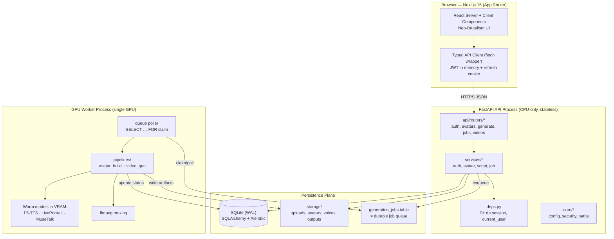
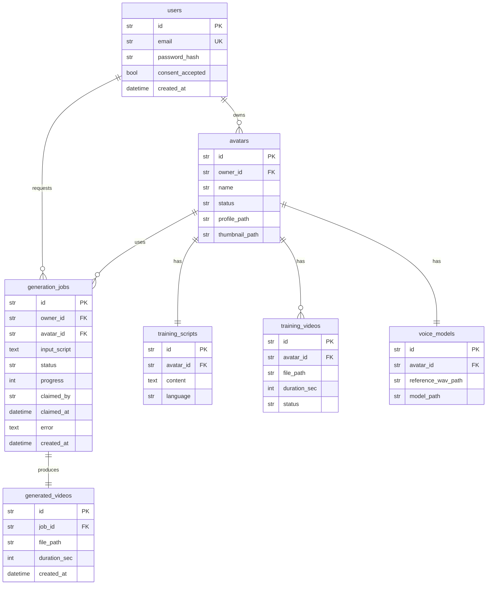
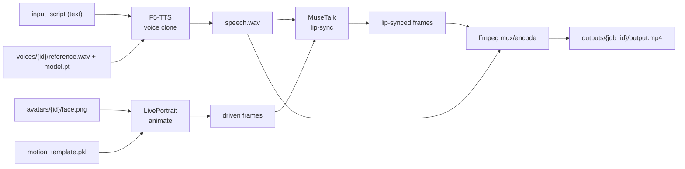

# AI Avatar Platform — System Architecture

> **Status:** Implementation-ready specification (MVP)
> **Audience:** Claude Code (build agent) + human reviewers
> **Scope:** Self-hosted talking-head avatar platform. Open-source models only. No commercial APIs.

This document is the single source of truth for the system architecture. It is consistent with the canonical project spec: the DB tables, API routes, storage layout, and top-level folders defined there are treated as fixed contracts and must not be contradicted by implementation.

**Top-level layout (fixed):**

```
ai-avatar-platform/
├── frontend/      # Next.js 15 + TypeScript + Tailwind (neo-brutalism)
├── backend/       # FastAPI + Python, SQLAlchemy, Alembic
├── storage/       # local filesystem artifact store
├── ml_models/     # downloaded open-source model weights + adapters
└── docs/          # architecture, runbooks, model cards
```

---

## 1. High-Level Architecture

The platform is a **three-tier system with a GPU worker plane**. The Next.js client talks only to the FastAPI API over HTTP/JSON. FastAPI owns the SQLite database, the local filesystem storage, and a **DB-backed job queue**. A separate long-lived **GPU worker process** polls the queue and runs the three heavy models (F5-TTS, LivePortrait, MuseTalk) plus ffmpeg.

The API process is deliberately **stateless and GPU-free** so it stays responsive; all VRAM-bound work is offloaded to the worker. This split matters on single-GPU Kaggle/HF-Spaces hosting, where holding models warm in the API would block request handling and exhaust memory.



**Key boundaries**

| Concern | Owner | Notes |
|---|---|---|
| HTTP, auth, validation | API process | No torch import in API |
| Source of truth | SQLite + filesystem | DB stores metadata + paths; bytes live on disk |
| Heavy compute | GPU worker | Owns CUDA context, holds models warm |
| Coordination | `generation_jobs` table | Single durable queue; survives restarts |

---

## 2. Frontend Architecture

### 2.1 Next.js 15 App Router structure

We use the App Router with **server components by default**. Client components are opt-in (`"use client"`) only where interactivity or browser APIs (MediaRecorder for webcam capture, polling hooks, forms) are required.

- **Server Components**: list pages (avatars list, jobs list), detail shells, anything that reads data at request time. These call the API server-side using the user's access token forwarded from cookies.
- **Client Components**: the recorder/uploader, the script editor, the generation form, status pollers, and all neo-brutalist interactive widgets.

```
frontend/src/app/
├── layout.tsx                # root: fonts (mono accent), <body> brutalist bg
├── page.tsx                  # landing / marketing
├── (auth)/
│   ├── login/page.tsx
│   └── signup/page.tsx
├── (app)/
│   ├── layout.tsx            # authed shell + nav (server)
│   ├── avatars/
│   │   ├── page.tsx          # GET /api/avatars (server)
│   │   ├── new/page.tsx      # Create Avatar wizard (client)
│   │   └── [id]/
│   │       ├── page.tsx      # avatar detail (server)
│   │       ├── record/page.tsx   # script + record/upload (client)
│   │       └── status/page.tsx   # polling processing status (client)
│   ├── generate/page.tsx     # type script → POST /api/generate (client)
│   └── jobs/
│       ├── page.tsx          # GET /api/jobs (server)
│       └── [id]/page.tsx     # job detail + download (client poll)
```

### 2.2 API client layer

A single typed client wraps `fetch`, injects the access token, and transparently refreshes on 401. Access token lives **in memory** (a module-level store / React context); the **refresh token is an httpOnly cookie** set by the backend.

```ts
// src/lib/api/client.ts
import { getAccessToken, setAccessToken } from "./token-store";

const BASE = process.env.NEXT_PUBLIC_API_URL!; // e.g. http://localhost:8000

async function refresh(): Promise<boolean> {
  const r = await fetch(`${BASE}/api/auth/refresh`, {
    method: "POST",
    credentials: "include", // send httpOnly refresh cookie
  });
  if (!r.ok) return false;
  const { access_token } = await r.json();
  setAccessToken(access_token);
  return true;
}

export async function apiFetch<T>(
  path: string,
  init: RequestInit = {},
  retry = true,
): Promise<T> {
  const headers = new Headers(init.headers);
  const token = getAccessToken();
  if (token) headers.set("Authorization", `Bearer ${token}`);
  if (init.body && !(init.body instanceof FormData)) {
    headers.set("Content-Type", "application/json");
  }

  const res = await fetch(`${BASE}${path}`, {
    ...init,
    headers,
    credentials: "include",
  });

  if (res.status === 401 && retry && (await refresh())) {
    return apiFetch<T>(path, init, false);
  }
  if (!res.ok) throw new ApiError(res.status, await safeJson(res));
  return (await safeJson(res)) as T;
}
```

Typed endpoint helpers live alongside (`src/lib/api/avatars.ts`, `generate.ts`, `jobs.ts`) and mirror the canonical routes exactly.

### 2.3 State management

Keep it lean for the MVP:

- **Server state / data fetching**: React Server Components for reads; `@tanstack/react-query` for client-side polling of `GET /api/avatars/{id}/status` and `GET /api/jobs/{id}` (built-in `refetchInterval`, exponential backoff, cache).
- **Auth/session**: lightweight React context holding the in-memory access token + current user (`GET /api/auth/me`).
- **Local UI state**: component-local `useState`/`useReducer`. No global store (Redux/Zustand) needed at MVP size.

### 2.4 Neo-Brutalism design tokens

Design language: **thick black borders, hard offset shadows (no blur), solid high-contrast color blocks, chunky buttons, monospace accents.** Encode this as Tailwind theme tokens + a small set of shadow/border utilities so every component is consistent.

```js
// tailwind.config.ts (excerpt)
import type { Config } from "tailwindcss";

const config: Config = {
  content: ["./src/**/*.{ts,tsx}"],
  theme: {
    extend: {
      colors: {
        ink: "#0A0A0A",          // borders + text
        paper: "#FFFDF5",        // base background
        brut: {
          yellow: "#FFD600",
          pink: "#FF4FA3",
          blue: "#2D5BFF",
          green: "#00C566",
          red: "#FF3B30",
          lilac: "#B388FF",
        },
      },
      fontFamily: {
        mono: ["'JetBrains Mono'", "ui-monospace", "monospace"],
        sans: ["'Inter'", "system-ui", "sans-serif"],
      },
      borderWidth: { 3: "3px", 5: "5px" },
      boxShadow: {
        // hard offset shadows, zero blur — the brutalist signature
        brut: "4px 4px 0 0 #0A0A0A",
        "brut-lg": "8px 8px 0 0 #0A0A0A",
        "brut-press": "1px 1px 0 0 #0A0A0A",
      },
      borderRadius: { brut: "2px" },
    },
  },
  plugins: [],
};
export default config;
```

Chunky button component — encodes the "press" interaction (shadow shrinks, element nudges down/right):

```tsx
// src/components/ui/BrutalButton.tsx
"use client";
import { cva, type VariantProps } from "class-variance-authority";
import { cn } from "@/lib/cn";

const button = cva(
  "inline-flex items-center justify-center font-mono font-bold uppercase tracking-wide " +
    "border-3 border-ink rounded-brut shadow-brut " +
    "transition-all duration-75 active:translate-x-1 active:translate-y-1 active:shadow-brut-press " +
    "disabled:opacity-50 disabled:pointer-events-none focus-visible:outline-none " +
    "focus-visible:ring-4 focus-visible:ring-brut-blue",
  {
    variants: {
      color: {
        yellow: "bg-brut-yellow text-ink",
        pink: "bg-brut-pink text-ink",
        blue: "bg-brut-blue text-paper",
        green: "bg-brut-green text-ink",
      },
      size: { md: "h-11 px-5 text-sm", lg: "h-14 px-8 text-base" },
    },
    defaultVariants: { color: "yellow", size: "md" },
  },
);

type Props = React.ButtonHTMLAttributes<HTMLButtonElement> &
  VariantProps<typeof button>;

export function BrutalButton({ color, size, className, ...props }: Props) {
  return <button className={cn(button({ color, size }), className)} {...props} />;
}
```

Shared primitives (`BrutalCard`, `BrutalInput`, `BrutalBadge`, `ProgressBar`) reuse the same `border-3 border-ink shadow-brut` recipe so the whole UI reads as one system.

---

## 3. Backend Architecture

### 3.1 Layering

FastAPI app organized as **routers → services → pipelines/workers**, with cross-cutting `core`, `models`, `schemas`, `deps`. Routers are thin (validation + auth + delegation); business logic lives in services; GPU work lives in pipelines invoked by the worker.

```
backend/app/
├── main.py                # FastAPI app factory, middleware, router mounting
├── core/
│   ├── config.py          # pydantic-settings Settings
│   ├── security.py        # JWT encode/decode, password hashing
│   ├── paths.py           # storage path builders (see §5)
│   └── logging.py
├── db/
│   ├── base.py            # Declarative Base
│   ├── session.py         # engine + SessionLocal + get_db
│   └── init_db.py
├── models/                # SQLAlchemy ORM (one file per table)
│   ├── user.py  training_script.py  training_video.py
│   ├── avatar.py  voice_model.py
│   └── generation_job.py  generated_video.py
├── schemas/               # Pydantic request/response DTOs
├── api/
│   ├── deps.py            # get_current_user, get_db, pagination
│   └── routers/
│       ├── auth.py  avatars.py  generate.py  jobs.py  videos.py
├── services/
│   ├── auth_service.py  avatar_service.py
│   ├── script_service.py  job_service.py
├── pipelines/             # imported by worker only (torch lives here)
│   ├── avatar_build.py    # face/voice/expression/motion analysis
│   └── video_gen.py       # F5-TTS → LivePortrait → MuseTalk → ffmpeg
├── workers/
│   └── gpu_worker.py      # long-lived queue poller (separate process)
└── alembic/               # migrations
```

### 3.2 Settings via pydantic-settings

```python
# app/core/config.py
from functools import lru_cache
from pydantic import Field
from pydantic_settings import BaseSettings, SettingsConfigDict

class Settings(BaseSettings):
    model_config = SettingsConfigDict(env_file=".env", extra="ignore")

    app_env: str = "dev"
    database_url: str = "sqlite:///./storage/app.db"
    storage_root: str = "./storage"
    models_root: str = "./ml_models"

    jwt_secret: str = Field(..., min_length=32)
    jwt_algorithm: str = "HS256"
    access_token_ttl_min: int = 15
    refresh_token_ttl_days: int = 7

    cors_origins: list[str] = ["http://localhost:3000"]
    max_upload_mb: int = 500
    download_url_ttl_sec: int = 300

    worker_poll_interval_sec: float = 2.0
    worker_id: str = "gpu-0"

@lru_cache
def get_settings() -> Settings:
    return Settings()
```

### 3.3 Auth middleware & dependency injection

Auth is enforced via a FastAPI dependency, not global middleware, so public routes (`signup`, `login`, `refresh`) stay open while everything else requires a valid bearer token.

```python
# app/api/deps.py
from fastapi import Depends, HTTPException, status
from fastapi.security import HTTPBearer, HTTPAuthorizationCredentials
from sqlalchemy.orm import Session
from app.db.session import SessionLocal
from app.core.security import decode_access_token
from app.models.user import User

bearer = HTTPBearer(auto_error=True)

def get_db() -> Session:
    db = SessionLocal()
    try:
        yield db
    finally:
        db.close()

def get_current_user(
    creds: HTTPAuthorizationCredentials = Depends(bearer),
    db: Session = Depends(get_db),
) -> User:
    try:
        payload = decode_access_token(creds.credentials)
    except Exception:
        raise HTTPException(status.HTTP_401_UNAUTHORIZED, "Invalid token")
    user = db.get(User, payload["sub"])
    if not user or not user.is_active:
        raise HTTPException(status.HTTP_401_UNAUTHORIZED, "Unknown user")
    return user
```

Routers then declare `user: User = Depends(get_current_user)`. **Ownership checks** are explicit in services: every avatar/job/video lookup filters by `owner_id == user.id` (prevents IDOR; see §9).

Cross-cutting middleware mounted in `main.py`: CORS (allow-list from settings), request-ID + structured logging, and a simple in-memory/Redis-optional rate limiter on auth + generate routes.

---

## 4. Database Architecture

### 4.1 Engine & session setup

SQLite is run in **WAL mode** so the API process (writers/readers) and the worker process (readers/writers) can operate concurrently. We set a `busy_timeout` so transient lock contention retries instead of erroring.

```python
# app/db/session.py
from sqlalchemy import create_engine, event
from sqlalchemy.orm import sessionmaker
from app.core.config import get_settings

settings = get_settings()

engine = create_engine(
    settings.database_url,
    connect_args={"check_same_thread": False, "timeout": 30},
    pool_pre_ping=True,
)

@event.listens_for(engine, "connect")
def _set_sqlite_pragmas(dbapi_conn, _):
    cur = dbapi_conn.cursor()
    cur.execute("PRAGMA journal_mode=WAL;")
    cur.execute("PRAGMA synchronous=NORMAL;")
    cur.execute("PRAGMA foreign_keys=ON;")
    cur.execute("PRAGMA busy_timeout=30000;")  # 30s
    cur.close()

SessionLocal = sessionmaker(bind=engine, autoflush=False, autocommit=False)
```

### 4.2 Schema (canonical tables)



### 4.3 The job queue (using `generation_jobs`)

No external broker. `generation_jobs` **is** the queue. Status lifecycle:

`queued → claimed → processing → completed | failed`

The worker claims a job atomically using a short transaction so two workers (or restarts) never double-process. With SQLite + WAL, the claim is a single `UPDATE ... WHERE status='queued'` guarded by the row state:

```python
# app/services/job_service.py (worker side, simplified)
def claim_next_job(db, worker_id: str) -> GenerationJob | None:
    with db.begin():  # immediate transaction
        job = (
            db.query(GenerationJob)
            .filter(GenerationJob.status == "queued")
            .order_by(GenerationJob.created_at)
            .with_for_update(skip_locked=True)  # no-op on SQLite; harmless
            .first()
        )
        if not job:
            return None
        job.status = "claimed"
        job.claimed_by = worker_id
        job.claimed_at = datetime.utcnow()
    return job
```

> **SQLite note:** `skip_locked`/`FOR UPDATE` are PostgreSQL semantics; on SQLite the `busy_timeout` + single-writer guarantee plus the `status='queued'` predicate is what enforces exclusivity. For the single-GPU MVP there is exactly **one** worker, so contention is effectively zero — the design simply remains correct if a second worker is added later or on a future Postgres swap.

**Progress + heartbeat:** the worker updates `progress` (0–100) and `status` as the pipeline advances; the API exposes these via `GET /api/jobs/{id}` for client polling. A startup sweep re-queues jobs stuck in `claimed/processing` whose `claimed_at` is older than a TTL (crash recovery).

### 4.4 Migrations

Alembic manages schema. `alembic/env.py` imports `app.db.base:Base.metadata` for autogenerate. Migrations run on deploy before the API starts. SQLite has limited `ALTER TABLE`, so we configure Alembic with `render_as_batch=True` for safe column changes.

---

## 5. Storage Architecture

### 5.1 Canonical layout (fixed)

```
storage/
├── app.db                                  # SQLite
├── uploads/{user_id}/{video_id}.mp4        # raw user recordings
├── avatars/{avatar_id}/
│   ├── profile.json                        # analyzed face/voice/expression metadata
│   ├── face.png                            # canonical reference frame
│   ├── motion_template.pkl                 # head-movement / expression template
│   └── thumbnail.png
├── voices/{avatar_id}/
│   ├── reference.wav                        # clean reference audio for F5-TTS
│   └── model.pt                             # cloned-voice adapter/checkpoint
└── outputs/{job_id}/output.mp4              # final generated video
```

### 5.2 Path-builder helper

All filesystem access goes through one module. Nothing in services/pipelines concatenates paths by hand — this centralizes traversal defense (§9) and keeps the layout canonical.

```python
# app/core/paths.py
from pathlib import Path
from app.core.config import get_settings

_ROOT = Path(get_settings().storage_root).resolve()

def _safe(root: Path, *parts: str) -> Path:
    p = (root.joinpath(*parts)).resolve()
    if not str(p).startswith(str(root)):       # traversal guard
        raise ValueError("Path escapes storage root")
    return p

def upload_path(user_id: str, video_id: str) -> Path:
    return _safe(_ROOT, "uploads", user_id, f"{video_id}.mp4")

def avatar_dir(avatar_id: str) -> Path:
    return _safe(_ROOT, "avatars", avatar_id)

def voice_dir(avatar_id: str) -> Path:
    return _safe(_ROOT, "voices", avatar_id)

def output_path(job_id: str) -> Path:
    return _safe(_ROOT, "outputs", job_id, "output.mp4")
```

`*_id` values are server-generated UUIDs, never user-supplied strings, so they cannot contain `../`.

### 5.3 Cleanup & retention

- **Orphan sweep** (scheduled task): delete `outputs/{job_id}` for jobs older than N days, and `uploads/` recordings once an avatar is fully built (the analyzed artifacts in `avatars/`+`voices/` are what we keep).
- **Cascade delete**: `DELETE /api/avatars/{id}` removes DB rows **and** the on-disk `avatars/{id}`, `voices/{id}`, and related uploads, inside one transaction-then-fs-cleanup flow (DB committed last so a crash leaves recoverable disk garbage, never a dangling DB ref).
- **Quotas**: per-user storage cap enforced in `avatar_service` before accepting uploads.

### 5.4 Serving files securely

Files are **never** served from a public static mount. Downloads go through `GET /api/videos/{id}/download`, which:

1. authenticates the user, 2. verifies `generated_video.job.owner_id == user.id`, 3. resolves the path via `output_path()`, 4. streams it with `FileResponse` and a `Content-Disposition` attachment header.

Optionally we issue **short-lived signed download tokens** (HMAC of `video_id + expiry`) so a download URL can be handed to the `<video>` tag / download button without leaking the bearer token in the URL. Token TTL = `download_url_ttl_sec`.

---

## 6. AI Pipeline Architecture

### 6.1 Models & roles

| Model | Role | When it runs |
|---|---|---|
| **F5-TTS** | Voice cloning + text-to-speech | Avatar build (reference embedding) + generation (synthesize speech from script) |
| **LivePortrait** | Face/expression/head-motion animation | Avatar build (extract motion template) + generation (animate the face frame) |
| **MuseTalk** | Lip-sync (mouth region driven by audio) | Generation (align lips to synthesized speech) |
| **mediapipe / insightface** | Face landmarks & detection | Avatar build (validate single clear face, crop, build `face.png`) |
| **ffmpeg** | Audio/video mux, encode, normalize | Both stages |

### 6.2 Two pipelines

**A. Avatar build** (`pipelines/avatar_build.py`) — runs once per avatar:
1. Probe + normalize the uploaded video (ffmpeg: fps/resolution/audio extract).
2. Face detection/landmarks (insightface + mediapipe) → validate a single, well-lit face; pick the best frame → `face.png`.
3. Extract head-movement / expression template via LivePortrait motion extractor → `motion_template.pkl`.
4. Extract clean reference audio → `reference.wav`; build F5-TTS speaker reference → `model.pt`.
5. Write `profile.json` (landmark stats, face crop box, voice ref metadata, durations) + `thumbnail.png`.
6. Mark avatar `ready`.

**B. Video generation** (`pipelines/video_gen.py`) — runs per job:
1. **F5-TTS**: synthesize speech from `input_script` using the avatar's voice reference → `speech.wav`.
2. **LivePortrait**: animate `face.png` using `motion_template.pkl` for natural head/expression motion → driven frames.
3. **MuseTalk**: drive the mouth region from `speech.wav` to lip-sync the frames.
4. **ffmpeg**: mux animated frames + audio, encode H.264/AAC → `outputs/{job_id}/output.mp4`.
5. Insert `generated_videos` row, mark job `completed`.



### 6.3 Model loading & warm-keeping on a single GPU

The GPU worker loads each model **once at startup** into a registry and keeps them warm for the process lifetime (avoids per-job multi-second load cost). The API process never imports torch.

```python
# app/workers/gpu_worker.py (sketch)
class ModelRegistry:
    def __init__(self):
        self.tts = None; self.liveportrait = None; self.musetalk = None
    def warm(self):
        import torch
        self.tts = load_f5_tts(device="cuda")
        self.liveportrait = load_liveportrait(device="cuda")
        self.musetalk = load_musetalk(device="cuda")

def main():
    reg = ModelRegistry(); reg.warm()
    while True:
        job = claim_next_job(db, settings.worker_id)
        if not job:
            time.sleep(settings.worker_poll_interval_sec); continue
        run_video_gen(reg, job)   # updates progress + status
```

### 6.4 VRAM considerations (single GPU, ~16 GB Kaggle T4/P100)

The three models can be heavy when co-resident. Strategy, in order of preference:

1. **Keep warm + fp16/half precision** where supported; this is the default if all three fit.
2. **Sequential staging within a job**: TTS runs first and can release its graph before LivePortrait/MuseTalk peak; use `torch.cuda.empty_cache()` between stages to reclaim fragmentation.
3. **If they don't co-fit**, offload idle models to CPU and `.to("cuda")` on demand per stage (slower but bounded). This is configurable via a `WARM_ALL` flag.
4. Serialize jobs — **one job at a time** per GPU (the single-worker queue already guarantees this), so peak VRAM = max single-stage footprint, not sum of concurrent jobs.

Generation is chunked by sentence/segment to cap frame-buffer memory and to emit `progress` updates.

---

## 7. Request Flow Diagrams

### 7.1 Avatar creation (script → record → async build → poll)

```mermaid
sequenceDiagram
    actor U as User (browser)
    participant FE as Next.js
    participant API as FastAPI
    participant DB as SQLite
    participant FS as storage/
    participant W as GPU Worker

    U->>FE: Create Avatar (name, consent)
    FE->>API: POST /api/avatars
    API->>DB: insert avatar (status=draft)
    API-->>FE: 201 {avatar_id}

    FE->>API: POST /api/avatars/{id}/script
    API->>API: generate training script (template)
    API->>DB: insert training_scripts
    API-->>FE: 200 {script}

    U->>FE: record/upload 2–5 min video
    FE->>API: POST /api/avatars/{id}/video (multipart)
    API->>API: validate type/size/duration
    API->>FS: write uploads/{user}/{video}.mp4
    API->>DB: insert training_videos; avatar.status=processing
    API->>DB: enqueue build job (generation_jobs, kind=build)
    API-->>FE: 202 accepted

    loop poll until ready
        FE->>API: GET /api/avatars/{id}/status
        API->>DB: read status/progress
        API-->>FE: {status, progress}
    end

    W->>DB: claim build job
    W->>FS: read upload → analyze face/voice/motion
    W->>FS: write avatars/{id}/* and voices/{id}/*
    W->>DB: avatar.status=ready; job=completed
    FE-->>U: Avatar ready ✓
```

### 7.2 Video generation (enqueue → worker → download)

```mermaid
sequenceDiagram
    actor U as User
    participant FE as Next.js
    participant API as FastAPI
    participant DB as SQLite
    participant Q as generation_jobs
    participant W as GPU Worker
    participant FS as storage/outputs

    U->>FE: type script + pick avatar
    FE->>API: POST /api/generate {avatar_id, script}
    API->>API: verify ownership + sanitize script
    API->>DB: insert generation_jobs (status=queued)
    API-->>FE: 202 {job_id}

    loop poll
        FE->>API: GET /api/jobs/{id}
        API->>DB: read {status, progress}
        API-->>FE: {status, progress}
    end

    W->>Q: claim_next_job() (queued→claimed)
    W->>DB: status=processing
    W->>FS: F5-TTS → LivePortrait → MuseTalk → ffmpeg
    W->>FS: write outputs/{job_id}/output.mp4
    W->>DB: insert generated_videos; job=completed (progress=100)

    FE->>API: GET /api/videos/{video_id}/download
    API->>API: authz: owner check + resolve path
    API->>FS: stream output.mp4
    API-->>U: MP4 (attachment)
```

---

## 8. Folder Structure

### 8.1 Frontend

```
frontend/
├── package.json
├── next.config.ts
├── tailwind.config.ts
├── tsconfig.json
├── .env.local                       # NEXT_PUBLIC_API_URL
├── public/
│   └── fonts/                        # JetBrains Mono, Inter
└── src/
    ├── app/                          # App Router (see §2.1)
    │   ├── layout.tsx
    │   ├── page.tsx
    │   ├── (auth)/login|signup/page.tsx
    │   └── (app)/
    │       ├── layout.tsx
    │       ├── avatars/{page,new,[id]/...}
    │       ├── generate/page.tsx
    │       └── jobs/{page,[id]/page}.tsx
    ├── components/
    │   ├── ui/                       # BrutalButton, BrutalCard, BrutalInput…
    │   ├── avatar/                   # Recorder, Uploader, ScriptEditor
    │   └── jobs/                     # StatusBadge, ProgressBar, VideoPlayer
    ├── lib/
    │   ├── api/{client,avatars,generate,jobs,auth}.ts
    │   ├── token-store.ts
    │   ├── hooks/{usePollJob,usePollAvatar,useAuth}.ts
    │   └── cn.ts
    └── types/api.ts                  # shared response types
```

### 8.2 Backend

```
backend/
├── pyproject.toml                    # fastapi, uvicorn, sqlalchemy, alembic,
│                                     # pydantic-settings, argon2-cffi, python-jose
├── alembic.ini
├── .env
├── README.md
└── app/
    ├── main.py
    ├── core/{config,security,paths,logging}.py
    ├── db/{base,session,init_db}.py
    ├── models/
    │   ├── user.py  training_script.py  training_video.py
    │   ├── avatar.py  voice_model.py
    │   └── generation_job.py  generated_video.py
    ├── schemas/
    │   ├── auth.py  avatar.py  job.py  video.py  common.py
    ├── api/
    │   ├── deps.py
    │   └── routers/{auth,avatars,generate,jobs,videos}.py
    ├── services/
    │   ├── auth_service.py  avatar_service.py
    │   ├── script_service.py  job_service.py
    ├── pipelines/
    │   ├── __init__.py
    │   ├── avatar_build.py
    │   ├── video_gen.py
    │   └── steps/{tts.py, animate.py, lipsync.py, mux.py, face.py}
    ├── workers/
    │   └── gpu_worker.py
    └── alembic/
        ├── env.py
        └── versions/
```

### 8.3 ml_models / storage / docs

```
ml_models/
├── f5_tts/            # weights + config
├── liveportrait/
├── musetalk/
└── download.py        # idempotent model fetch from Hugging Face

storage/   → see §5
docs/      → SYSTEM_ARCHITECTURE.md (this), RUNBOOK.md, MODEL_CARDS.md
```

---

## 9. Security Considerations

Actionable engineering guidance. Each item is a concrete control to implement, not a principle.

### 9.1 Authentication & authorization (JWT)
- **Tokens**: short-lived access JWT (15 min, in-memory on client) + long-lived **refresh token in an httpOnly, Secure, SameSite=Strict cookie**. Refresh rotates; on refresh, issue a new refresh token and invalidate the old (store a token `jti`/version on the user row).
- **Authorization is ownership-scoped**: every service query for avatars/jobs/videos must filter by `owner_id == current_user.id`. Never trust a path `{id}` alone — this is the primary IDOR defense. Return `404` (not `403`) for resources the user doesn't own to avoid existence leaks.
- Validate JWT `exp`, `iat`, signature, and an `aud`/issuer claim. Reject `alg=none`.

### 9.2 Password hashing
- Use **argon2id** (`argon2-cffi`) with sane params (e.g. `time_cost=3, memory_cost=64MiB, parallelism=4`); bcrypt is an acceptable fallback. Never store or log plaintext. Constant-time verify. Enforce a minimum password length (≥10) at the schema level.

### 9.3 File-upload validation
- **Hard limits**: reject `Content-Length > max_upload_mb` (500 MB) early; stream to a temp file, never load fully into memory.
- **Type checks**: validate MIME *and* magic bytes (sniff container) — don't trust the extension or client header. Accept only `video/mp4` (+ a small allow-list). Re-encode/normalize through ffmpeg so the stored file is sanitized (strips malformed/exploit containers).
- **Content checks**: enforce duration bounds (2–5 min), single detected face (insightface) before accepting — reject otherwise with a clear error.
- Generate the stored filename server-side (`{video_id}.mp4` UUID); never use the client filename on disk.

### 9.4 Path-traversal prevention
- All paths via `app/core/paths.py` `_safe()` which resolves and asserts the result stays under `storage_root`. IDs are server-generated UUIDs. No user string ever reaches `os.path.join` for a storage path.

### 9.5 Scoped/signed download URLs
- `GET /api/videos/{id}/download` enforces auth + ownership, then streams via `FileResponse` with `Content-Disposition: attachment`. No public static mount of `storage/`.
- Optional **HMAC-signed, time-boxed download tokens** (`download_url_ttl_sec=300`) so the player/download link doesn't carry the bearer token. Verify HMAC + expiry server-side before streaming.

### 9.6 Rate limiting & abuse
- Per-IP + per-user limits on `/api/auth/login`, `/api/auth/signup` (brute-force defense, e.g. 5/min) and `/api/generate` (GPU is the scarce resource — cap concurrent + daily jobs per user). Implement with `slowapi` or a small DB/Redis counter. Return `429` with `Retry-After`.

### 9.7 Consent gating (critical for talking-head/deepfake)
- Avatar creation **must** be gated by an explicit recorded consent checkbox (`users.consent_accepted` + per-avatar consent flag + timestamp). The training script itself should include a spoken consent sentence ("I consent to creating an AI avatar of my likeness…"), giving an in-video consent artifact.
- Block creating an avatar from a face that isn't the recorded uploader where feasible; at minimum, require the consent attestation and log it immutably.

### 9.8 Deepfake / misuse mitigations
- **Provenance watermark**: embed a visible "AI-generated" badge and/or invisible watermark + C2PA-style metadata in every `output.mp4` so generated content is traceable.
- **Audit trail**: log who generated what, when, from which avatar (retain `generation_jobs` history). Allow account-level takedown / avatar deletion that cascades artifacts.
- Optionally screen input scripts for disallowed impersonation/abuse categories before queuing.

### 9.9 Secrets handling
- `jwt_secret`, any model/HF tokens come from environment / `.env` (gitignored), never committed. Fail fast at startup if `jwt_secret` is short or default. On HF Spaces, use the Secrets manager; on Kaggle, use Kaggle Secrets — never inline in notebooks.

### 9.10 CORS
- Strict allow-list from `settings.cors_origins` (no `*` with credentials). Allow only the known frontend origin(s), restrict methods/headers, `allow_credentials=True` only for the cookie-based refresh endpoint.

### 9.11 Model-input sanitization
- Treat `input_script` as untrusted text: enforce max length (e.g. ≤5000 chars), strip control characters, normalize unicode, and reject scripts that would produce excessive video length (DoS via huge generation). Never pass user text into a shell — ffmpeg/model calls use `subprocess` arg lists, **never** `shell=True` string interpolation.

### 9.12 Transport & headers
- HTTPS everywhere (terminated by the host platform). Set `X-Content-Type-Options: nosniff`, a restrictive `Content-Security-Policy` on the frontend, and `Strict-Transport-Security`. Disable detailed error leakage in `app_env=prod` (generic 500s; full traces only to server logs).

---

### Appendix — Build order for Claude Code
1. Backend skeleton: `core/config`, `db/session`, models, Alembic init + first migration.
2. Auth (signup/login/refresh/me) + `deps.get_current_user`.
3. Avatars CRUD + script + upload (validation, storage paths) + status.
4. `generation_jobs` queue + `job_service.claim_next_job` + worker loop (stubbed pipelines).
5. Real pipelines: `steps/face`, `tts`, `animate`, `lipsync`, `mux`; model download script.
6. Frontend: API client + auth context → avatars list/new/record → generate → jobs/download.
7. Security pass: rate limits, signed downloads, watermark, consent gating, CORS lockdown.
