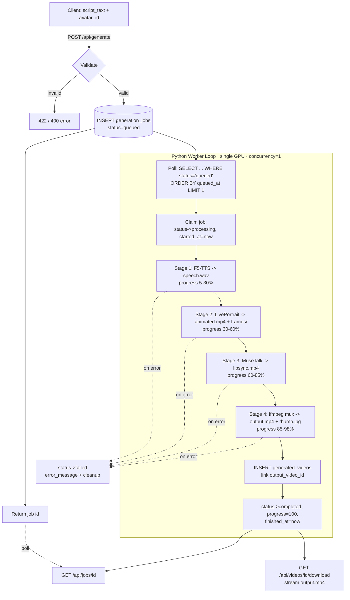
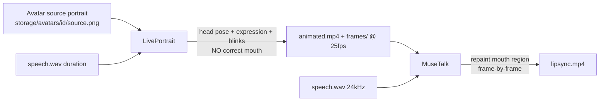
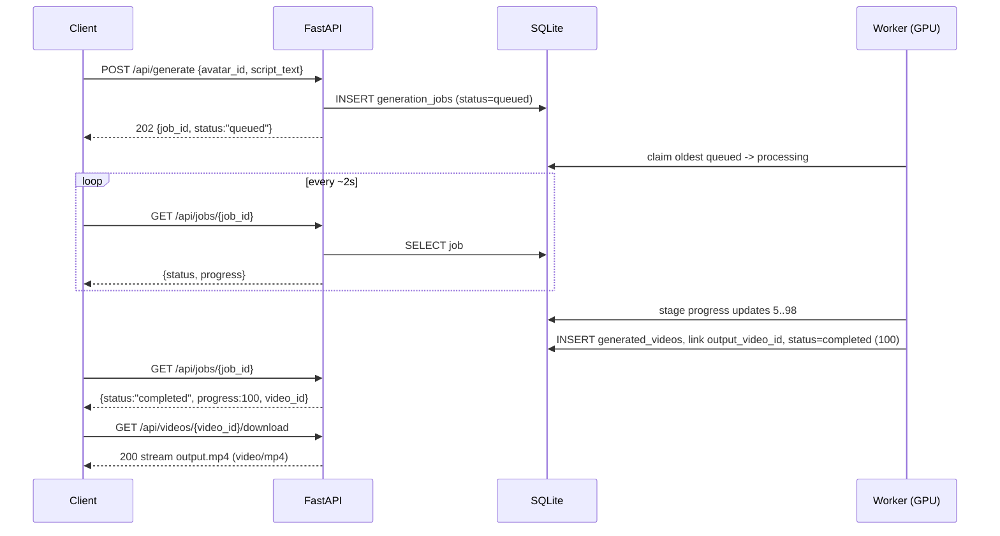

# Video Generation Pipeline (Reuse Flow)

**Project:** AI Avatar Platform — MVP
**Scope:** Video Generation (reuse). A user types a script and picks an already-trained avatar; the system produces a downloadable H.264 MP4 of that avatar speaking the script in the avatar's cloned voice.
**Stack:** FastAPI + Python · SQLite + SQLAlchemy · local filesystem · single Kaggle GPU · DB-backed job queue polled by a Python worker process.

This document is implementation-ready and intended to be handed directly to Claude Code. It contains the orchestration code, ffmpeg commands, queue logic, and diagrams needed to build the generation half of the platform. The *avatar creation / voice cloning* flow (which populates `storage/avatars/{avatar_id}/` and `storage/voices/{avatar_id}/`) is covered by a sibling document; here we consume those artifacts.

---

## Model Pipeline at a Glance

The generation pipeline runs **four** stages in a fixed order. The ordering and the division of responsibility between LivePortrait and MuseTalk is the most commonly misunderstood part, so it is stated explicitly up front:

| # | Stage | Model / Tool | Input | Output | Responsibility |
|---|-------|--------------|-------|--------|----------------|
| 1 | TTS | **F5-TTS** | `script_text` + avatar's `reference.wav` + voice config | `speech.wav` (24 kHz mono) | Synthesize new speech in the **cloned voice** |
| 2 | Animation | **LivePortrait** | avatar source image/portrait + target duration | `animated.mp4` + `frames/` | **Head pose + facial expression + blinks**. Mouth is *not* trustworthy yet. |
| 3 | Lip-sync | **MuseTalk** | `animated.mp4` frames + `speech.wav` | `lipsync.mp4` | **Mouth region only** — repaints the lips to match the audio phonemes. |
| 4 | Mux | **ffmpeg** | `lipsync.mp4` + `speech.wav` | `output.mp4` | Encode H.264 + AAC, faststart, thumbnail. |

> **Key integration rule:** LivePortrait owns *everything except the mouth* (global head motion, expression, eyes). MuseTalk owns *the mouth*. We deliberately run LivePortrait **first** to get natural head/expression motion of the correct duration, then MuseTalk **overwrites the lip region** of those frames so the visible speech matches `speech.wav`. Reversing this order would let LivePortrait's incorrect mouth motion bleed back over MuseTalk's output.

---

## 1. Pipeline Overview



The HTTP layer never touches the GPU. Its only job is validation + enqueue + status reporting + file streaming. All heavy work happens in a separate long-lived worker process so a single FastAPI request can return in milliseconds.

---

## 2. Script Input Workflow

### Endpoint: `POST /api/generate`

Request body:

```json
{
  "avatar_id": 42,
  "script_text": "Hi, welcome to our product demo. Today I'll show you three features."
}
```

Validation rules (all enforced **before** the job row is created):

| Rule | Check | On failure |
|------|-------|------------|
| Avatar exists | `avatars` row with `id=avatar_id` | `404 avatar_not_found` |
| Avatar usable | `avatars.status == 'ready'` | `409 avatar_not_ready` |
| Voice present | `voice_models` row for avatar exists + `reference.wav` on disk | `409 voice_not_ready` |
| Non-empty script | `len(script_text.strip()) > 0` | `422 empty_script` |
| Max length | `len(script_text) <= 5000` chars (~800 words) | `422 script_too_long` |
| Min length | `len(script_text.strip()) >= 2` chars | `422 script_too_short` |
| Language | detect; MVP supports `en` only | `422 unsupported_language` |
| Profanity / abuse | run a lightweight wordlist/classifier flag | `422 content_policy` (see note) |

> **Profanity / abuse note:** For the MVP we run a fast, conservative wordlist check plus a length-bounded heuristic. This is *not* a content-moderation system; it only blocks egregious cases and logs flagged submissions to `generation_jobs.moderation_flag`. A real deployment should swap in a proper classifier and human review queue. Do not rely on it for safety guarantees.

**Duration estimate** (used for queue ETA and to pre-size LivePortrait frame count). Average conversational speaking rate ≈ **150 words/min ≈ 2.5 words/sec**:

```python
def estimate_duration_seconds(script_text: str, words_per_minute: int = 150) -> float:
    words = max(1, len(script_text.split()))
    return round(words / (words_per_minute / 60.0), 2)
```

### FastAPI handler

```python
from fastapi import APIRouter, HTTPException
from pydantic import BaseModel, Field
from datetime import datetime, timezone

router = APIRouter(prefix="/api")

MAX_SCRIPT_CHARS = 5000

class GenerateRequest(BaseModel):
    avatar_id: int
    script_text: str = Field(..., min_length=1)

class GenerateResponse(BaseModel):
    job_id: int
    status: str
    estimated_duration_s: float

@router.post("/generate", response_model=GenerateResponse, status_code=202)
def create_generation(req: GenerateRequest, db: Session = Depends(get_db)):
    script = req.script_text.strip()
    if not script:
        raise HTTPException(422, "empty_script")
    if len(req.script_text) > MAX_SCRIPT_CHARS:
        raise HTTPException(422, "script_too_long")

    avatar = db.get(Avatar, req.avatar_id)
    if avatar is None:
        raise HTTPException(404, "avatar_not_found")
    if avatar.status != "ready":
        raise HTTPException(409, "avatar_not_ready")

    voice = db.query(VoiceModel).filter_by(avatar_id=avatar.id).first()
    if voice is None or not Path(voice.reference_path).exists():
        raise HTTPException(409, "voice_not_ready")

    if not language_is_supported(script):
        raise HTTPException(422, "unsupported_language")

    flag = moderation_flag(script)  # "clean" | "blocked" | "review"
    if flag == "blocked":
        raise HTTPException(422, "content_policy")

    job = GenerationJob(
        avatar_id=avatar.id,
        script_text=script,
        status="queued",
        progress=0,
        estimated_duration_s=estimate_duration_seconds(script),
        moderation_flag=flag,
        queued_at=datetime.now(timezone.utc),
    )
    db.add(job)
    db.commit()
    db.refresh(job)
    return GenerateResponse(
        job_id=job.id, status=job.status,
        estimated_duration_s=job.estimated_duration_s,
    )
```

The handler returns `202 Accepted` — the work has been *accepted for processing*, not completed.

---

## 3. Voice Generation Workflow (F5-TTS)

**Goal:** turn `script_text` into `speech.wav` in the avatar's cloned voice. Inputs live in `storage/voices/{avatar_id}/`:

```
storage/voices/{avatar_id}/
├── reference.wav        # short clean reference of the cloned voice
├── reference.txt        # transcript of reference.wav (F5-TTS needs ref text)
└── config.json          # model checkpoint name, sample rate, speed, seed
```

### Why chunk by sentence

F5-TTS quality and VRAM both degrade on very long single-shot generations, and a single OOM kills the whole utterance. We split the script into sentence-sized chunks, synthesize each independently (reusing the same reference embedding), then concatenate. This bounds peak VRAM and makes failures recoverable (we can re-chunk smaller on OOM — see §9).

```python
import re
import numpy as np
import soundfile as sf
import torch

SAMPLE_RATE = 24000          # F5-TTS native output rate
MAX_CHARS_PER_CHUNK = 220    # ~1-2 sentences; shrink on OOM retry

def split_into_chunks(text: str, max_chars: int = MAX_CHARS_PER_CHUNK) -> list[str]:
    # Sentence-ish boundaries, then greedily pack up to max_chars.
    sentences = re.split(r'(?<=[.!?])\s+', text.strip())
    chunks, buf = [], ""
    for s in sentences:
        if len(buf) + len(s) + 1 <= max_chars:
            buf = (buf + " " + s).strip()
        else:
            if buf:
                chunks.append(buf)
            # A single sentence longer than max_chars: hard-split on commas/spaces.
            buf = s if len(s) <= max_chars else ""
            if not buf:
                for piece in _hard_wrap(s, max_chars):
                    chunks.append(piece)
    if buf:
        chunks.append(buf)
    return chunks


def synthesize_speech(job, voice_cfg, model, out_path: Path,
                      max_chars: int = MAX_CHARS_PER_CHUNK,
                      progress_cb=None) -> float:
    """Returns the duration (seconds) of the produced speech.wav."""
    ref_audio = voice_cfg["reference_path"]      # storage/voices/{id}/reference.wav
    ref_text  = voice_cfg["reference_text"]
    chunks = split_into_chunks(job.script_text, max_chars)

    # Reference embedding is computed once and reused across chunks (see §10).
    ref_embed = model.prepare_reference(ref_audio, ref_text)

    wavs = []
    for i, chunk in enumerate(chunks):
        with torch.inference_mode():
            wav = model.infer(
                text=chunk,
                ref_embedding=ref_embed,
                speed=voice_cfg.get("speed", 1.0),
                seed=voice_cfg.get("seed", 0),
            )  # -> float32 numpy at 24kHz
        wavs.append(wav)
        # ~250ms of silence between chunks keeps prosody natural.
        wavs.append(np.zeros(int(0.25 * SAMPLE_RATE), dtype=np.float32))
        if progress_cb:
            progress_cb(int(100 * (i + 1) / len(chunks)))

    speech = np.concatenate(wavs)
    speech = normalize_peak(speech, target_dbfs=-1.0)   # avoid clipping
    sf.write(out_path, speech, SAMPLE_RATE, subtype="PCM_16")
    return len(speech) / SAMPLE_RATE


def normalize_peak(x: np.ndarray, target_dbfs: float = -1.0) -> np.ndarray:
    peak = np.max(np.abs(x)) + 1e-9
    target = 10 ** (target_dbfs / 20.0)
    return (x * (target / peak)).astype(np.float32)
```

Notes:
- Output is **24 kHz mono PCM16** — written once to `storage/outputs/{job_id}/speech.wav`. This file is the *single source of truth* for audio length downstream.
- We measure the actual `speech.wav` duration and use it (not the word-count estimate) to size the video.
- Loudness normalization to a −1 dBFS peak prevents clipping; a more advanced build can use EBU R128 (`ffmpeg loudnorm`) as a post-step.

---

## 4. Lip-Sync Workflow (LivePortrait → MuseTalk)

This is the two-stage visual core. **LivePortrait animates the whole head; MuseTalk fixes the mouth.**



### Stage 2 — LivePortrait (pose & expression)

LivePortrait takes the avatar's source portrait (and optional driving motion template) and produces a *talking-head animation of a fixed length*. We drive it to a frame count derived from the audio duration so the two streams line up:

```python
FPS = 25  # project-wide canonical fps

def run_liveportrait(job, avatar_dir: Path, audio_seconds: float,
                     out_dir: Path, lp_model) -> Path:
    n_frames = max(1, round(audio_seconds * FPS))
    source = avatar_dir / "source.png"            # cached repr reused (see §10)
    src_repr = lp_model.cache_source(source)      # crop, landmarks, appearance feat

    frames_dir = out_dir / "frames"
    frames_dir.mkdir(parents=True, exist_ok=True)

    # Drive with a looped/idle motion template stretched to n_frames so head
    # motion, blinks and expression span the full audio. Mouth output here is
    # NOT used as final - MuseTalk overwrites it.
    lp_model.animate(
        source_repr=src_repr,
        driving="idle_talking_template",   # bundled neutral talking motion
        n_frames=n_frames,
        fps=FPS,
        out_frames_dir=frames_dir,
        out_video=out_dir / "animated.mp4",
    )
    return out_dir / "animated.mp4"
```

Key points:
- **Frame count = round(audio_seconds × FPS).** With a fixed 25 fps, a 12.0 s clip → 300 frames. If LivePortrait's driving template is shorter, we loop/ping-pong it; if longer, we trim.
- We persist `frames/` as PNGs because MuseTalk consumes per-frame images and we want a deterministic, resumable artifact.

### Stage 3 — MuseTalk (mouth accuracy)

MuseTalk takes the *already-animated* frames plus `speech.wav` and **inpaints only the lower-face / lip region** so the visible articulation matches the phonemes. The rest of each frame (eyes, head pose, background) is left exactly as LivePortrait produced it.

```python
def run_musetalk(job, animated_video: Path, frames_dir: Path,
                 speech_wav: Path, out_dir: Path, mt_model) -> Path:
    lipsync_path = out_dir / "lipsync.mp4"
    mt_model.inference(
        video_frames_dir=frames_dir,   # LivePortrait output frames
        audio_path=speech_wav,         # 24kHz mono speech
        fps=FPS,
        bbox_shift=0,                  # vertical lip-region offset; tune per avatar
        out_video=lipsync_path,        # writes muxed-less video (frames only)
    )
    return lipsync_path
```

### Frame / audio alignment — the contract

- Both stages agree on **FPS = 25** and the **same `speech.wav` duration**.
- MuseTalk internally aligns its audio feature windows to frame indices `0..n_frames-1`. Because LivePortrait already emitted `n_frames = round(dur × FPS)` frames, MuseTalk's per-frame mouth predictions land on the correct frames.
- Off-by-one drift at the tail (audio slightly longer/shorter than `n_frames/FPS`) is corrected at mux time: ffmpeg uses `-shortest`, and we pad the final frame by ≤ 1/FPS if needed. Drift is bounded by < 40 ms and is imperceptible.

---

## 5. Video Rendering Workflow (ffmpeg)

MuseTalk produces a silent video (or frame sequence). We mux in `speech.wav`, encode to web-friendly **H.264 / yuv420p** with `+faststart`, and generate a thumbnail.

### Canonical render settings

| Setting | Value | Rationale |
|---------|-------|-----------|
| Container | MP4 | Universally playable, supports faststart |
| Video codec | `libx264` | Broad compatibility, software encode works on any Kaggle GPU image |
| Pixel format | `yuv420p` | Required for Safari/QuickTime/mobile |
| Resolution | 512×512 (square) MVP | Matches MuseTalk crop; upscale optional |
| FPS | 25 | Matches generation FPS |
| CRF | 20 | Visually lossless-ish, reasonable size |
| Preset | `medium` | Quality/speed balance |
| Audio codec | AAC 128 kbps | Standard |
| `+faststart` | yes | Moves moov atom to front for instant web playback |

### Exact ffmpeg command (video + audio → output.mp4)

```bash
ffmpeg -y \
  -i storage/outputs/{job_id}/lipsync.mp4 \
  -i storage/outputs/{job_id}/speech.wav \
  -map 0:v:0 -map 1:a:0 \
  -c:v libx264 -preset medium -crf 20 -pix_fmt yuv420p -r 25 \
  -c:a aac -b:a 128k -ar 44100 \
  -movflags +faststart \
  -shortest \
  storage/outputs/{job_id}/output.mp4
```

If MuseTalk emitted a **frame sequence** instead of a video, encode directly from PNGs:

```bash
ffmpeg -y \
  -framerate 25 -i storage/outputs/{job_id}/frames/%05d.png \
  -i storage/outputs/{job_id}/speech.wav \
  -c:v libx264 -preset medium -crf 20 -pix_fmt yuv420p \
  -c:a aac -b:a 128k -ar 44100 \
  -movflags +faststart -shortest \
  storage/outputs/{job_id}/output.mp4
```

### Thumbnail (poster frame at ~1s)

```bash
ffmpeg -y -ss 1 -i storage/outputs/{job_id}/output.mp4 \
  -frames:v 1 -q:v 3 storage/outputs/{job_id}/thumb.jpg
```

### Python wrapper

```python
import subprocess

def ffmpeg_mux(out_dir: Path) -> Path:
    output = out_dir / "output.mp4"
    cmd = [
        "ffmpeg", "-y",
        "-i", str(out_dir / "lipsync.mp4"),
        "-i", str(out_dir / "speech.wav"),
        "-map", "0:v:0", "-map", "1:a:0",
        "-c:v", "libx264", "-preset", "medium", "-crf", "20",
        "-pix_fmt", "yuv420p", "-r", "25",
        "-c:a", "aac", "-b:a", "128k", "-ar", "44100",
        "-movflags", "+faststart", "-shortest",
        str(output),
    ]
    subprocess.run(cmd, check=True, capture_output=True, text=True)
    subprocess.run(
        ["ffmpeg", "-y", "-ss", "1", "-i", str(output),
         "-frames:v", "1", "-q:v", "3", str(out_dir / "thumb.jpg")],
        check=True, capture_output=True, text=True,
    )
    return output
```

`subprocess.run(..., check=True)` raises `CalledProcessError` on non-zero exit; we capture `stderr` into `error_message` on failure (§9).

---

## 6. Storage Workflow

### Layout

```
storage/
├── avatars/{avatar_id}/
│   └── source.png                # avatar portrait (input, read-only here)
├── voices/{avatar_id}/
│   ├── reference.wav             # cloned-voice reference (input)
│   ├── reference.txt
│   └── config.json
└── outputs/{job_id}/             # everything this job produces
    ├── speech.wav                # Stage 1
    ├── frames/                   # Stage 2 (PNG sequence %05d.png)
    ├── animated.mp4              # Stage 2
    ├── lipsync.mp4               # Stage 3
    ├── output.mp4                # Stage 4 — FINAL
    └── thumb.jpg                 # Stage 4
```

### On success

```python
def finalize_storage(db, job, out_dir: Path, duration_s: float, width=512, height=512):
    output = out_dir / "output.mp4"
    video = GeneratedVideo(
        job_id=job.id,
        avatar_id=job.avatar_id,
        file_path=str(output),                 # storage/outputs/{job_id}/output.mp4
        thumbnail_path=str(out_dir / "thumb.jpg"),
        duration_s=round(duration_s, 2),
        width=width, height=height, fps=25,
        size_bytes=output.stat().st_size,
        created_at=datetime.now(timezone.utc),
    )
    db.add(video)
    db.flush()                                 # get video.id
    job.output_video_id = video.id             # link generation_jobs -> generated_videos
    db.commit()
```

`generated_videos.file_path` is always `storage/outputs/{job_id}/output.mp4`, per the canonical spec.

### Intermediate cleanup policy

Intermediates (`frames/`, `animated.mp4`, `lipsync.mp4`, `speech.wav`) are large and only needed during processing. Policy:

- **On success:** keep `output.mp4` + `thumb.jpg`. Delete `frames/` immediately (largest artifact). Keep `speech.wav`, `animated.mp4`, `lipsync.mp4` for a 24 h grace window (debugging / re-mux), then a daily cron removes them.
- **On failure:** keep all intermediates for the failed job (debugging) but remove any partial/zero-byte `output.mp4` so it is never served (§9).

```python
import shutil

def cleanup_intermediates(out_dir: Path, keep_grace: bool = True):
    frames = out_dir / "frames"
    if frames.exists():
        shutil.rmtree(frames, ignore_errors=True)
    if not keep_grace:
        for f in ("speech.wav", "animated.mp4", "lipsync.mp4"):
            (out_dir / f).unlink(missing_ok=True)
```

---

## 7. Queue Workflow (DB-backed)

### Design

- The queue **is** the `generation_jobs` table. No Redis/Celery — one SQLite DB + one worker process.
- Concurrency is **1**: a single Kaggle GPU can only run one generation at a time. Serialization is implicit because there is one worker, and reinforced by the claim step below.
- The worker is a long-lived Python process (separate from FastAPI) running a poll loop.

### Job lifecycle

```
queued ──claim──> processing ──success──> completed
                       │
                       ├──error────────> failed
                       └──cancel req───> cancelled
```

### Claiming a job atomically

SQLite has no `SELECT ... FOR UPDATE`, so we claim with a **conditional UPDATE** that only succeeds if the row is still `queued`. The single-worker model makes contention nearly impossible, but this keeps the claim correct even if a second worker is ever added:

```python
def claim_next_job(db) -> GenerationJob | None:
    # Pick the oldest queued job.
    job = (db.query(GenerationJob)
             .filter(GenerationJob.status == "queued")
             .order_by(GenerationJob.queued_at.asc())
             .first())
    if job is None:
        return None
    # Conditional claim: rowcount==1 means WE got it.
    now = datetime.now(timezone.utc)
    updated = (db.query(GenerationJob)
                 .filter(GenerationJob.id == job.id,
                         GenerationJob.status == "queued")
                 .update({"status": "processing",
                          "started_at": now,
                          "heartbeat_at": now,
                          "progress": 1},
                         synchronize_session=False))
    db.commit()
    if updated != 1:
        return None        # someone else claimed it; loop again
    db.refresh(job)
    return job
```

### Progress + heartbeat

Each stage reports into a fixed band so progress is monotonic and meaningful to the UI:

| Stage | Progress band |
|-------|---------------|
| Claimed | 1% |
| F5-TTS | 5 → 30% |
| LivePortrait | 30 → 60% |
| MuseTalk | 60 → 85% |
| ffmpeg mux + thumb | 85 → 98% |
| Finalized | 100% |

```python
def set_progress(db, job, pct: int):
    job.progress = max(job.progress, min(98, pct))
    job.heartbeat_at = datetime.now(timezone.utc)
    db.commit()

def check_cancelled(db, job) -> bool:
    db.refresh(job)
    return job.status == "cancelled"   # API may have set this externally
```

`heartbeat_at` is bumped on every progress update so a stuck job can be detected (§9).

### Cancellation

`POST` to a cancel route (or `PATCH /api/jobs/{id}`) sets `status='cancelled'` only if the job is `queued` or `processing`. The worker checks `check_cancelled()` between stages and aborts cleanly. A job already `completed`/`failed` cannot be cancelled.

### Worker loop sketch

```python
import time, traceback

POLL_INTERVAL_S = 2.0

def worker_main():
    models = load_models_once()     # F5-TTS, LivePortrait, MuseTalk kept warm (§10)
    while True:
        db = SessionLocal()
        try:
            requeue_zombie_jobs(db)             # §9 heartbeat sweep
            job = claim_next_job(db)
            if job is None:
                db.close()
                time.sleep(POLL_INTERVAL_S)
                continue
            run_generation_job(db, job, models)
        except Exception:
            traceback.print_exc()               # never let the loop die
        finally:
            db.close()
```

---

## 8. API Interactions

### Sequence



### Routes

| Method | Path | Purpose |
|--------|------|---------|
| POST | `/api/generate` | Create job (§2) |
| GET | `/api/jobs/{id}` | Poll one job |
| GET | `/api/jobs` | List jobs (paginated) |
| GET | `/api/videos/{id}/download` | Stream final MP4 |

### Sample bodies

`POST /api/generate` → `202`:

```json
{ "job_id": 1007, "status": "queued", "estimated_duration_s": 12.4 }
```

`GET /api/jobs/1007` while running:

```json
{
  "job_id": 1007,
  "avatar_id": 42,
  "status": "processing",
  "progress": 63,
  "stage": "musetalk",
  "estimated_duration_s": 12.4,
  "queued_at": "2026-06-16T10:00:00Z",
  "started_at": "2026-06-16T10:00:05Z",
  "output_video_id": null,
  "error_message": null
}
```

`GET /api/jobs/1007` when done:

```json
{
  "job_id": 1007,
  "status": "completed",
  "progress": 100,
  "output_video_id": 880,
  "video_url": "/api/videos/880/download",
  "finished_at": "2026-06-16T10:01:55Z"
}
```

### Download handler (streaming)

```python
from fastapi.responses import FileResponse

@router.get("/videos/{video_id}/download")
def download_video(video_id: int, db: Session = Depends(get_db)):
    video = db.get(GeneratedVideo, video_id)
    if video is None or not Path(video.file_path).exists():
        raise HTTPException(404, "video_not_found")
    return FileResponse(
        video.file_path,
        media_type="video/mp4",
        filename=f"avatar_{video.avatar_id}_video_{video.id}.mp4",
    )
```

`FileResponse` streams with range-request support, so browsers can seek/scrub without downloading the whole file.

---

## 9. Failure Recovery

### Per-stage failure handling

Every stage runs inside `run_generation_job`'s `try/except`. On any exception we capture a truncated `error_message`, mark `failed`, and clean partial artifacts:

```python
def fail_job(db, job, stage: str, exc: Exception, out_dir: Path):
    msg = f"[{stage}] {type(exc).__name__}: {exc}"
    if isinstance(exc, subprocess.CalledProcessError) and exc.stderr:
        msg += f" | ffmpeg: {exc.stderr[-500:]}"
    job.status = "failed"
    job.error_message = msg[:2000]
    job.finished_at = datetime.now(timezone.utc)
    db.commit()
    # Remove any partial final output so it is never served.
    (out_dir / "output.mp4").unlink(missing_ok=True)
```

### OOM handling with adaptive chunking

CUDA OOM is the most common GPU failure. We catch it specifically and **retry with smaller chunks / lower batch** before giving up:

```python
def synth_with_oom_retry(job, voice_cfg, model, out_path, progress_cb):
    for max_chars in (220, 120, 60):
        try:
            torch.cuda.empty_cache()
            return synthesize_speech(job, voice_cfg, model, out_path,
                                     max_chars=max_chars, progress_cb=progress_cb)
        except torch.cuda.OutOfMemoryError:
            torch.cuda.empty_cache()
            continue
    raise RuntimeError("F5-TTS OOM even at smallest chunk size")
```

A similar ladder applies to MuseTalk (reduce its internal batch size) and LivePortrait (process frames in smaller windows).

### Stuck / zombie job detection (heartbeat timeout)

If the worker crashes mid-job, the row is stranded in `processing`. A heartbeat sweep at the top of the loop requeues or fails such jobs:

```python
HEARTBEAT_TIMEOUT_S = 600     # 10 min with no progress = zombie
MAX_RETRIES = 2

def requeue_zombie_jobs(db):
    cutoff = datetime.now(timezone.utc) - timedelta(seconds=HEARTBEAT_TIMEOUT_S)
    zombies = (db.query(GenerationJob)
                 .filter(GenerationJob.status == "processing",
                         GenerationJob.heartbeat_at < cutoff)
                 .all())
    for job in zombies:
        if job.retry_count < MAX_RETRIES:
            job.retry_count += 1
            job.status = "queued"           # requeue
            job.started_at = None
            job.progress = 0
            job.error_message = f"requeued after heartbeat timeout (try {job.retry_count})"
        else:
            job.status = "failed"
            job.error_message = "exceeded max retries after heartbeat timeouts"
            job.finished_at = datetime.now(timezone.utc)
    if zombies:
        db.commit()
```

### Requeue & max-retries policy

- A job may be requeued up to `MAX_RETRIES = 2` times (3 total attempts).
- Transient errors (OOM after the chunk ladder, GPU hiccups, worker crash) → requeue.
- Deterministic errors (bad input file, missing reference.wav, corrupt source.png) → fail immediately, no retry (retrying won't help).

### Idempotent re-run

Re-running a job must be safe. The output dir is keyed by `job_id`, so a retry overwrites its own intermediates. At the start of each attempt we wipe stale partial outputs:

```python
def prepare_output_dir(job) -> Path:
    out_dir = Path(f"storage/outputs/{job.id}")
    out_dir.mkdir(parents=True, exist_ok=True)
    # Idempotency: clear partial outputs from a prior crashed attempt.
    (out_dir / "output.mp4").unlink(missing_ok=True)
    shutil.rmtree(out_dir / "frames", ignore_errors=True)
    return out_dir
```

Because `finalize_storage` only creates the `generated_videos` row *after* `output.mp4` exists and is non-empty, a partial run never produces a downloadable, half-baked video.

---

## The Orchestration Function

This is the heart of the worker — staged progress with per-stage `try/except` that funnels into `fail_job`.

```python
def run_generation_job(db, job, models):
    out_dir = prepare_output_dir(job)
    voice_cfg = load_voice_config(job.avatar_id)     # storage/voices/{avatar_id}/
    avatar_dir = Path(f"storage/avatars/{job.avatar_id}")
    stage = "init"
    try:
        # ---- Stage 1: F5-TTS ----
        stage = "f5_tts"; set_progress(db, job, 5)
        speech_path = out_dir / "speech.wav"
        duration_s = synth_with_oom_retry(
            job, voice_cfg, models.tts, speech_path,
            progress_cb=lambda p: set_progress(db, job, 5 + int(0.25 * p)),
        )
        if check_cancelled(db, job): return

        # ---- Stage 2: LivePortrait ----
        stage = "liveportrait"; set_progress(db, job, 30)
        run_liveportrait(job, avatar_dir, duration_s, out_dir, models.liveportrait)
        set_progress(db, job, 60)
        if check_cancelled(db, job): return

        # ---- Stage 3: MuseTalk ----
        stage = "musetalk"; set_progress(db, job, 62)
        run_musetalk(job, out_dir / "animated.mp4", out_dir / "frames",
                     speech_path, out_dir, models.musetalk)
        set_progress(db, job, 85)
        if check_cancelled(db, job): return

        # ---- Stage 4: ffmpeg mux ----
        stage = "ffmpeg"; set_progress(db, job, 88)
        ffmpeg_mux(out_dir)
        set_progress(db, job, 98)

        # ---- Finalize ----
        stage = "finalize"
        finalize_storage(db, job, out_dir, duration_s)
        cleanup_intermediates(out_dir, keep_grace=True)
        job.status = "completed"
        job.progress = 100
        job.finished_at = datetime.now(timezone.utc)
        db.commit()

    except torch.cuda.OutOfMemoryError as e:
        torch.cuda.empty_cache()
        # Let zombie/requeue logic or explicit retry handle transient OOM.
        if job.retry_count < MAX_RETRIES:
            job.retry_count += 1
            job.status = "queued"; job.progress = 0; job.started_at = None
            job.error_message = f"OOM at {stage}, requeued (try {job.retry_count})"
            db.commit()
        else:
            fail_job(db, job, stage, e, out_dir)
    except Exception as e:
        fail_job(db, job, stage, e, out_dir)
```

---

## 10. Performance Optimization

### Keep models warm

The single biggest win on a single GPU is **never reloading model weights**. `worker_main()` calls `load_models_once()` at startup and passes the handle to every job. F5-TTS, LivePortrait, and MuseTalk weights stay resident in VRAM for the worker's lifetime.

```python
@dataclass
class Models:
    tts: object
    liveportrait: object
    musetalk: object

def load_models_once() -> Models:
    torch.backends.cuda.matmul.allow_tf32 = True
    return Models(
        tts=load_f5tts(fp16=True),
        liveportrait=load_liveportrait(fp16=True),
        musetalk=load_musetalk(fp16=True),
    )
```

### Caching reusable representations

- **TTS reference embedding:** computed once per job via `model.prepare_reference(...)` and reused across every chunk. Cache it per `avatar_id` (LRU) so repeated jobs for the same avatar skip it entirely.
- **LivePortrait source representation:** `cache_source(source.png)` (crop, landmarks, appearance features) is avatar-static. Cache per `avatar_id` so the second video for an avatar skips source preprocessing.

```python
from functools import lru_cache

@lru_cache(maxsize=64)
def cached_source_repr(avatar_id: int):
    return liveportrait.cache_source(Path(f"storage/avatars/{avatar_id}/source.png"))
```

### Half-precision (fp16)

All three models load in fp16 / autocast. This roughly halves VRAM and speeds inference, which matters on the memory-constrained Kaggle GPU. Use `torch.inference_mode()` everywhere (no autograd graph).

### Batch / chunk sizing

- F5-TTS: default 220-char chunks; the OOM ladder shrinks them automatically.
- MuseTalk: process frames in batches (e.g. 8–16 frames/forward) — the largest batch that fits gives best throughput. Drop on OOM.
- LivePortrait: stream frames; don't hold all PNGs in memory.

### ffmpeg hardware acceleration

Software `libx264` is the safe default and works on every Kaggle image. If the runtime exposes NVENC, swap the video encoder for a large speedup on the mux stage:

```bash
# NVENC variant (only if h264_nvenc is available):
ffmpeg -y -i lipsync.mp4 -i speech.wav -map 0:v:0 -map 1:a:0 \
  -c:v h264_nvenc -preset p4 -cq 23 -pix_fmt yuv420p \
  -c:a aac -b:a 128k -movflags +faststart -shortest output.mp4
```

Detect at startup with `ffmpeg -hide_banner -encoders | grep nvenc` and pick the encoder accordingly. Note NVENC contends with the same GPU the models use; on a single GPU the mux stage runs *after* inference, so contention is minimal.

### Realistic latency budget (single GPU, ~12 s output clip, 512×512, fp16)

| Stage | Approx. time | Notes |
|-------|-------------:|-------|
| Claim + setup | ~0.2 s | DB + dir prep |
| F5-TTS (warm) | ~8–15 s | scales with script length; chunked |
| LivePortrait | ~20–40 s | ~300 frames; pose/expression |
| MuseTalk | ~25–50 s | mouth inpaint per frame, batched |
| ffmpeg mux + thumb | ~3–6 s | libx264 medium; faster with NVENC |
| Finalize + cleanup | ~0.5 s | DB row + rmtree frames |
| **Total** | **~60–110 s** | ~5–9× realtime for a 12 s clip |

Cold start (first job after worker boot) adds ~15–30 s for model loading — amortized to zero on every subsequent job because models stay warm.

### Concurrency = 1 rationale & future scaling

- **Why 1:** one Kaggle GPU = one inference pipeline at a time. Running two jobs concurrently would thrash VRAM and likely OOM both. Serial execution maximizes per-job throughput and keeps the design simple (one worker, conditional-update claim).
- **Future scaling paths:**
  1. **More GPUs / workers:** run N worker processes, each binding one GPU (`CUDA_VISIBLE_DEVICES`). The conditional-update claim already makes the queue safe for multiple workers. Move the queue from SQLite to Postgres (`SELECT ... FOR UPDATE SKIP LOCKED`) once contention is real.
  2. **Stage-parallel pipeline:** F5-TTS for job N+1 can overlap LivePortrait/MuseTalk of job N if VRAM allows, since TTS and the visual stages have separate hot paths.
  3. **Pre-warm + persistent server:** replace cold subprocess calls with in-process model servers (already the case here) and add a small priority field to `generation_jobs` for paid-tier jumping the queue.

---

## Appendix: Canonical DB Fields Touched

`generation_jobs`: `id, avatar_id, script_text, status{queued|processing|completed|failed|cancelled}, progress(0-100), estimated_duration_s, moderation_flag, retry_count, output_video_id(FK), error_message, queued_at, started_at, heartbeat_at, finished_at`

`generated_videos`: `id, job_id(FK), avatar_id(FK), file_path(=storage/outputs/{job_id}/output.mp4), thumbnail_path, duration_s, width, height, fps, size_bytes, created_at`

`avatars`: `id, status('ready' required to generate), ...` · `voice_models`: `id, avatar_id(FK), reference_path, reference_text, config, ...`
